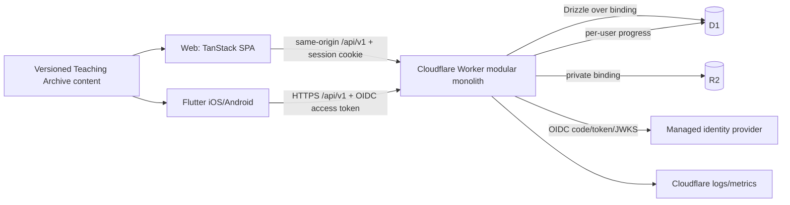

# Sadhana Yog Command Center — Engineering Foundation

Status: Proposed foundation for human approval  
Date: 2026-08-19  
Scope: architecture and engineering system only; no application features are implemented by this document

## 1. Executive recommendation

Build a small, secure modular monolith in this repository:

- `apps/api`: one Cloudflare Worker containing the versioned REST API and serving the built web application as static assets.
- `apps/web`: React, Vite, TanStack Router, TanStack Query, and TanStack Form.
- `apps/mobile`: one Flutter application targeting iOS and Android.
- `packages/contracts`: Zod request/response schemas, errors, and generated OpenAPI 3.1.
- `packages/db`: the Drizzle schema, reviewed SQL migrations, query helpers, and fixtures for Cloudflare D1.
- `content/teaching-archive`: stable-ID, versioned, language-neutral learning content reused by both clients.
- D1 as the single transactional database per environment and private R2 as object storage.

This is deliberately not a microservice architecture. The initial 2–3 users do not justify service discovery, queues, Kubernetes, distributed transactions, separate web servers, GraphQL, or a second database. Boundaries are enforced in code and documentation so a high-volume or independently operated area can be extracted later.

The backend is authoritative for authorization, financial arithmetic, membership consumption, attendance invariants, file access, and all other security-sensitive rules. TypeScript clients may share generated contracts, but Flutter maps generated transport DTOs into Dart domain models. Dart and TypeScript business implementations are not artificially shared.

## 2. Evidence and discovery baseline

The recommendations are based on direct inspection of these revisions:

| Repository | Revision inspected | Relevant evidence |
|---|---:|---|
| `sadhana-yog-command-center` | `c724be0e116582b5c73d324d00a81ac23eb0bbf2` | 17,286-line `index.html`; Apps Script sync; Worker static/proxy deployment; no package manifest or test suite |
| `yog-documentation` | `c6732f59cf66af9a238caaccc185104afa534d7f` | 1,875-line offline Teaching Archive; local-only progress and metadata; no build or tests |
| Flutter `samples` | `0c5ca75d2985ddeca92417bb1235f361d8643e7b` | official Compass MVVM/repository patterns, navigation, adaptive design, forms, and testing samples |
| `vivek-os` | `d41a7b294d65d004eea202ecabf78a4413b129c6` | layered agent instructions, decision-note lifecycle, Markdown issue DAG, postmortems, validation tooling |

### 2.1 Current Command Center

The current product is not merely a visual prototype. It contains material domain behavior inside global `SY.*` modules in one HTML file:

| Area | Behaviors that exist today and require explicit disposition |
|---|---|
| Today | operational command center, alerts, today's classes, money and work needing attention |
| Classes | recurring batches, one-off exceptions, courses, delivery modes, teachers, capacity, waiting lists, cancellation/rescheduling, meeting links |
| Attendance | per-session/student idempotency; present/late consume counted membership units while absent/excused do not |
| Students | CRM, health/goal notes, packages, balances, progress, communications, tags, timeline, archive state |
| Leads | enquiry, trial, pipeline state, source, conversion |
| Finance | income, expenses, profit, cash flow, receivables, aging, payouts, taxes, discounts |
| Invoices | draft/sent/paid/void/overdue workflows, print, reminders, UPI QR, line-item arithmetic |
| Work | tasks, repeat rules, My Day, reminders and automation rules |
| Communications | templates, audience filters, WhatsApp/mail/SMS deep links, message log; correctly reports “opened”, not “delivered” |
| Places | locations, coordinates, distance, maps and directions |
| Reports | ten operational and financial report families, date ranges, CSV and print |
| Settings | business, team, programs, packages, payments, invoicing, notifications, automation, integrations, flags, appearance, data and security |

Current pages are Today, Attendance, Students, Classes, Calendar, Business, Finance, Invoices, Tasks, Leads, Places, Messages, Reports, and Settings. Important nested states include student attention/package/debt filters, student profile tabs, class/course/team tabs, finance and invoice statuses, report types, and thirteen settings sections.

The canonical browser state currently lives under `localStorage` key `sadhanayog.v1`. Collections include programs, packages, batches, students, memberships, attendance, payments, events, instructors, locations, invoices, expenses, tasks, messages, reminders, leads, templates, rules, settings, connection state, and an outbox. Google Sheets can act as a last-write-wins shared store through Apps Script. Repeated class sessions are derived from batch rules plus exceptions rather than stored as a row per occurrence; preserve that semantic unless an ADR demonstrates a better invariant.

Current deployment is a Cloudflare Worker serving `public/` and proxying `/sync` to Apps Script with an upstream shared key. Cloudflare Access is assumed for the web hostname. There is no application user/role authorization, concurrent editing is last-write-wins, and device data is unencrypted. The CSP permits inline script/style because the application is one file. Apps Script and Worker documentation have drifted, and `tools/build-appsscript.py --check` currently reports a stale generated Apps Script HTML file. There is no automated test or CI suite beyond generator consistency checks.

There is no third-party JavaScript/CSS package or CDN dependency in the page; icons, styles and code are inline, and the favicon is a data SVG. Runtime network integration is limited to Google Apps Script sync and a Google Maps frame, with user-initiated links to Maps, Meet, Zoom, Teams, WhatsApp, mail/SMS and a configured payment page. “Documents” currently mean invoice printing plus JSON/CSV import/export; there is no managed file repository or general upload pipeline. These outbound schemes/hosts and import formats need an allowlist and migration decision rather than blanket preservation.

Accessibility positives include focus-visible styling, reduced-motion support, many labels, large controls, responsive CSS, and not relying exclusively on color. Risks include custom interactive div/table patterns, uncertain modal focus trapping, dense mobile information architecture, unverified screen-reader semantics, and no automated axe or keyboard suite.

### 2.2 Teaching Archive

The Teaching Archive is a coherent product experience, not a page to place in an iframe. It currently provides:

- Today: one daily line, taught/voice flags, a suggested task, and due rituals.
- Log: recording metadata and deterministic filenames without holding the media itself.
- Class review: delivery, pacing, filler, cue timing, room awareness, safety/options, reflection, and one carried-forward improvement.
- Rituals: weekly, monthly, quarterly, and annual checklists and notes.
- Guide: searchable content about camera, audio, light, file naming, folders, backup, privacy, review, and gear.
- Plan: first seven days, longer milestones, recording station checklist, wall card, settings, import/export, and erase.
- Benchmarks and journey phases based on elapsed days, intentionally tracking returns instead of streaks.

It uses `localStorage` key `teaching-archive.v1`, has no identity or remote persistence, and explicitly avoids media uploads. Its privacy guidance—no recording by default, specific revocable consent, no health data in filenames, and limited retention—is useful product content but is not an enforceable compliance control.

### 2.3 Reference patterns adopted and rejected

From Flutter samples, adopt explicit view/view-model/repository/service responsibilities, constructor dependency injection, `go_router`, test fakes, explicit asynchronous result states, and platform-adaptive chrome. Do not copy sample data models, demo repositories, or an example package merely because it appears in a sample.

From `vivek-os`, adopt concise layered `AGENTS.md` files, an executable Markdown issue graph, decision lifecycle records, issue/code co-evolution, and postmortems for escaped systemic failures. Do not copy its mature board size, every specialized agent, or operational complexity before this project needs it.

## 3. Disposition of existing assets

| Disposition | Items | Reason and migration path |
|---|---|---|
| Preserve behavior | attendance consumption rules; invoice arithmetic; receivable/aging logic; session derivation; communication “opened” semantics; teaching journey phases/content; privacy intent | Capture as fixtures and characterization tests before replacement. These are product knowledge. |
| Migrate | entities, settings, messages, automation rules, reports, archive progress, guide content, navigation concepts | Move to explicit domain/API/client boundaries and versioned content. Validate record counts and computed totals. |
| Reuse directly | wording/content after editorial review; icons/assets with proven licenses; CSV/import fixtures; calculation test vectors | Direct source code reuse is limited because the target runtimes differ. Preserve attribution and licenses. |
| Rewrite for a concrete reason | global DOM/state layer, localStorage persistence, Apps Script synchronization, inline CSS/JS, Worker proxy, client-authoritative rules | These mechanisms prevent safe authz, concurrent updates, testing, CSP hardening, mobile support, and schema evolution. |
| Deprecate | standalone shared-key sync; Google Sheets as operational source of truth; public/static application as the security boundary | Run read-only during a verified cutover window; remove after backup and acceptance sign-off. |
| Delete only after proof | generated Apps Script artifacts, old proxy/config docs, obsolete build scripts | Archive a tagged legacy revision and validated exports first. No destructive cleanup in foundation stages. |

## 4. Architectural principles

1. Optimize for 2–3 users: one deployable backend and one database per environment.
2. Preserve observed behavior before improving it; a rewrite is not permission to silently redesign workflows.
3. Treat organization identity and ownership as first-class from day one, but do not build multi-region tenancy machinery.
4. Keep the server authoritative. Client validation improves usability but cannot grant access or settle money.
5. Prefer online-first consistency. Cache learning content, drafts, and non-sensitive preferences; defer general offline mutation until a conflict model is approved.
6. Make contracts executable and migrations reviewable.
7. Store dates according to meaning: UTC instants for events, local date strings for class/business dates, and an IANA time-zone identifier for interpretation.
8. Use least privilege for humans, agents, tokens, bindings, and CI.
9. Documentation, issue state, decisions, tests, and runbooks are engineering artifacts and must change with behavior.
10. Add infrastructure only after measured need.

## 5. Target monorepo

```text
.
├── AGENTS.md
├── README.md
├── apps
│   ├── api
│   │   ├── src/{app,auth,http,middleware,modules,observability}
│   │   ├── test/{contract,integration,security}
│   │   ├── wrangler.jsonc
│   │   └── package.json
│   ├── mobile
│   │   ├── lib/{app,core,features,l10n}
│   │   ├── test
│   │   ├── integration_test
│   │   ├── android
│   │   ├── ios
│   │   ├── pubspec.yaml
│   │   └── pubspec.lock
│   └── web
│       ├── src/{app,components,features,routes,styles,test}
│       ├── e2e
│       └── package.json
├── packages
│   ├── contracts/{src,openapi,test}
│   ├── db/{src,migrations,test,fixtures}
│   └── config/{eslint,typescript,vitest}
├── content
│   └── teaching-archive/{manifest.json,content,schema,test}
├── tools/{tracker,migration,content,ci}
├── docs
│   ├── discovery
│   ├── product
│   ├── architecture
│   ├── api
│   ├── database
│   ├── security
│   ├── development
│   ├── testing
│   ├── deployment
│   ├── operations/{runbooks,troubleshooting}
│   ├── issue-tracking/{issues,templates,projects,archive}
│   ├── postmortems
│   └── roadmap
├── .agents
│   ├── notes/{proposed,implemented,rejected,archived}
│   └── skills/<skill-name>/SKILL.md
├── .codex/config.toml
├── .github/{workflows,CODEOWNERS,pull_request_template.md}
├── pnpm-workspace.yaml
├── package.json
├── mise.toml
└── .env.example
```

Generated files are clearly labelled. OpenAPI and the generated Dart client are committed so a contract change is reviewable; generated route trees may be ignored if deterministic and regenerated in CI. Secrets, `.dev.vars`, signing material, exported production data, local D1 state, and object payloads are never committed.

### 5.1 Runtime view



### 5.2 Dependency directions

- `apps/api` may depend on `packages/contracts` and `packages/db`.
- `apps/web` may depend on `packages/contracts` and `packages/config`, never `packages/db` or Worker internals.
- `packages/db` may use domain primitives from contracts only when this does not create a cycle; persistence rows are not API DTOs.
- `packages/contracts` has no dependency on an application or database implementation.
- Flutter depends on a pinned generated client package and local Dart domain code, not Node packages.
- Both clients consume the content manifest, but each renders with native components.
- Cross-feature imports go through a feature's public interface. Direct access to another feature's repository or persistence table is prohibited.

### 5.3 Dependency management

- Use pinned pnpm with one lockfile for TypeScript workspaces. Use `workspace:` links for internal packages.
- Use Flutter's own `pubspec.yaml` and committed `pubspec.lock`; pin the Flutter SDK through `mise.toml` (or FVM only if the team already standardizes on it).
- Pin Node, pnpm, Flutter, Dart, Wrangler, and Java toolchains. CI verifies the pins.
- Use Renovate or Dependabot for weekly grouped non-major updates; security updates receive separate high-priority review. No automatic merge for runtime, auth, database, mobile build, or major updates.
- Do not add Turborepo/Nx initially. Root scripts can orchestrate three applications; adopt a task graph only after CI timing demonstrates a need.

## 6. Application and package boundaries

### 6.1 Shared versus platform-specific

| Concern | Shared form | Platform-specific form |
|---|---|---|
| API shape | Zod plus generated OpenAPI | web TypeScript client; generated Dart transport client |
| Domain terms and invariants | documented glossary, API constraints, server tests | presentation-specific view models and harmless client checks |
| Authoritative business rules | Worker use cases | never duplicated as authority |
| Content | stable-ID JSON/Markdown and manifest | React renderer; Flutter native renderer |
| Design tokens | source token JSON where practical | CSS variables/components; Flutter `ThemeExtension`/widgets |
| Navigation and UI state | parity requirements | URL routes/browser history; mobile navigation stacks/deep links |
| Persistence | server resources and contracts | Query cache; secure mobile tokens and deliberately limited local cache |
| Accessibility outcomes | common acceptance criteria | semantic HTML/ARIA; Flutter Semantics/platform conventions |

Persistence rows, Drizzle models, web component props, and Flutter domain objects must remain distinct. This prevents database refactors from becoming public API breaks and lets each client follow its language's conventions.

### 6.2 Domain modules

Keep modules inside the single Worker and clients, aligned to product language:

- identity and organization
- students and tags
- programs, packages, classes and courses
- enrollments, memberships and attendance
- instructors and places
- invoices, payments, expenses and payouts
- leads
- tasks and automation
- communications and reminders
- reports
- teaching archive
- documents
- settings and audit

Each Worker module owns route registration, application use cases, repository interfaces/queries, authorization policy, and tests. Cross-module writes happen through use cases, not by importing another module's route handler.

## 7. Flutter architecture

Use Flutter's MVVM guidance with feature-first packaging and constructor dependency injection:

```text
lib/
  app/                 # bootstrap, router, theme, environment, DI composition
  core/                # API transport, auth, Result/failure, clock, IDs, logging
  features/<feature>/
    domain/            # Dart entities/value objects and repository contracts
    data/              # DTO mapping and repository implementations
    presentation/      # screens, widgets, view models
```

Recommendations:

- `go_router` with an authenticated shell and explicit redirect tests.
- `provider` for dependency injection and `ChangeNotifier` view models initially, matching current Flutter guidance and reducing code generation. Revisit Riverpod only if measured state-composition complexity justifies the additional project convention.
- A sealed `Result<T, AppFailure>` (or equivalent) and reusable command abstraction so loading, success, error, retry, and duplicate-submission behavior are explicit.
- Repositories hide transport/cache details; services wrap HTTP, OIDC, secure storage, deep links, file chooser, and platform APIs.
- Generated OpenAPI DTOs never reach widgets. Mappers validate and produce Dart domain objects.
- `flutter_secure_storage` (Keychain/Keystore) for refresh/session material. No secrets or confidential client credentials in the binary.
- Local persistence is opt-in by data class. Default: static learning content, unsent personal drafts, and non-sensitive display settings only. Operational PII and finance data remain network-backed in the first release.
- Adaptive navigation and platform chrome, while keeping content and task outcomes equivalent. Do not force pixel-identical iOS/Android/web layouts.
- WCAG-oriented semantics, text scaling, contrast, switch control/keyboard behavior, minimum targets, reduced motion, and screen-reader test cases.
- Build flavors `dev` and `prod`; add `staging` only if a persistent shared test environment is approved. Bundle identifiers, OAuth callbacks, API origins, and signing configurations must be environment-specific.

Alternative considered: a generic Clean Architecture with use cases for every read. Rejected initially because it adds ceremony for a tiny team. Introduce use-case objects for multi-repository, transactional, or policy-heavy operations; simple reads may flow view model → repository.

## 8. TanStack web architecture

Use a client-rendered React/Vite application. This private operations product has no public SEO or SSR requirement, and the separate Worker is already the server boundary. TanStack Start would duplicate server responsibilities and increase deployment complexity.

- TanStack Router: file-based, type-safe routes; authenticated layout redirects are UX only, never authorization.
- TanStack Query: server-state cache, mutation lifecycle, retry policy, invalidation, and optimistic updates only where conflicts are understood.
- TanStack Form with Zod schemas for accessible forms. Server errors remain authoritative and map to fields/problem details.
- TanStack Table only for dense, interactive tabular views; use semantic tables and simpler components elsewhere.
- Local React state for ephemeral UI. Do not add Redux/Zustand until a concrete cross-route client-state need appears.
- Route loaders prefetch critical Query data and propagate abort signals. Configure stale/refetch behavior deliberately for operational data; do not inherit defaults blindly.
- Same-origin API and `__Host-` session cookie. Never expose identity-provider client secrets or R2 credentials to JavaScript.
- Feature folders own views, components, query keys, form models, and tests. Shared components are promoted only after genuine reuse.
- Strict CSP without `unsafe-inline`/`unsafe-eval`; nonce/hash only when unavoidable. Use semantic HTML, visible focus, skip link, focus restoration, modal trapping, live error regions, reduced motion, axe, keyboard, and screen-reader checks.
- A service worker is not included initially. Static assets may be cached by Cloudflare/browser, but offline writes are not implied.

Future path: if public learning content later needs SEO, create a separately scoped pre-rendered/public surface or adopt TanStack Start through an ADR. Do not make the authenticated command center pay that cost now.

## 9. Cloudflare Worker architecture

Use TypeScript and Hono as the small routing/middleware layer, with `@hono/zod-openapi` (or an equivalently verified integration) connecting validated routes to the canonical OpenAPI document.

Request flow:

1. Request ID, structured timing, and security headers.
2. Exact origin/CORS policy and body/size limits.
3. Authentication normalization: web session cookie or mobile bearer token.
4. Organization membership and route authorization.
5. Zod validation for path/query/header/body.
6. Application use case and transaction/batch.
7. DTO mapping and response.
8. Redacted structured completion/error event.

Use `/api/v1` for the initial contract, `/auth/*` for the web OIDC/BFF flow, and minimal `/health/live` and protected `/health/ready`. Use RFC 9457-style problem details with a stable project error code, request ID, safe detail, and field errors. Never return stack traces or SQL errors.

The Worker deploys with the web build as one static-assets unit. Asset-first routing handles public boot assets; authenticated API/data always passes through the Worker. If the entire SPA shell must be private, configure Worker-first for HTML route patterns only rather than forcing all hashed assets through application code.

Transactions use D1 prepared statements and atomic `batch()` for bounded multi-write operations. Keep transactions short, avoid external network calls inside them, and design idempotency around retries. A database write and R2 upload cannot be atomic: use pending metadata → object write → ready metadata, with compensating cleanup.

Alternative considered: multiple Workers or Durable Objects by module. Rejected until concurrency, isolation, or independent deployment evidence appears. Extract a module behind its existing interface later.

## 10. D1 and Drizzle architecture

D1 is SQLite-based, not PostgreSQL. The phrase “D1 for postgresDB” is corrected here: use Drizzle's SQLite dialect and only D1-supported SQL. Do not use PostgreSQL arrays, enums, JSONB, sequences, advisory locks, row-level security, or extensions.

### 10.1 Storage conventions

- IDs: application-generated ULID strings in `TEXT`, never user-selectable.
- Instants: UTC Unix milliseconds in `INTEGER`; API exposes ISO 8601 UTC strings.
- Business dates: validated `YYYY-MM-DD` `TEXT`; interpret with organization IANA time zone.
- Money: integer minor units plus ISO currency; no floating point.
- Booleans/enums: constrained integers/text with `CHECK` constraints.
- Required ownership: `organization_id` on every tenant-owned row and at the left of common composite indexes.
- Concurrency: integer `version`, `updated_at`, and conditional update (`WHERE id=? AND version=?`). Conflict returns `409` with current version metadata.
- Deletion: `archived_at` for recoverable directory records; explicit void/reversal for financial facts; hard deletion only through approved retention/erasure flows.
- Audit: actor, action, target type/id, organization, time, request ID, and small redacted metadata. Audit events are append-only at the application level.

### 10.2 Proposed schema families

Exact columns and cascades are approved during domain/schema stages, but these are the intended boundaries:

| Family | Tables |
|---|---|
| Identity | `organizations`, `users`, `organization_memberships`, `invitations`, `web_sessions`, `oauth_transactions` |
| Teaching catalog | `programs`, `program_outline_items`, `packages`, `class_series`, `class_series_weekdays`, `class_occurrence_overrides`, `courses` |
| People/access | `students`, `tags`, `student_tags`, `instructors`, `locations` |
| Participation | `enrollments`, `waitlist_entries`, `memberships`, `attendance_records` |
| Finance | `invoices`, `invoice_items`, `payments`, `payment_allocations`, `expenses`, `payouts` |
| Work/growth | `leads`, `lead_tags`, `tasks`, `task_links`, `automation_rules` |
| Communication | `message_templates`, `message_events`, `reminders` |
| Learning | `learning_journeys`, `daily_reflections`, `archive_entries`, `class_reviews`, `ritual_completions`, `ritual_step_results`, `benchmark_results`, `content_progress` |
| Files/system | `objects`, `document_versions`, `idempotency_keys`, `audit_events`, `organization_settings` |

Critical uniqueness examples include `(organization_id, external_identity_provider, external_subject)`, `(organization_id, class_series_id, occurrence_date, student_id)` for attendance, idempotency keys scoped to actor/operation, and invoice numbers scoped to organization.

Normalize legacy comma-separated lists, invoice item JSON, and task links. JSON is acceptable only for bounded metadata that is not independently queried or constrained. Store a historical invoice line snapshot so later catalog changes cannot alter an issued invoice.

### 10.3 Migrations

- Drizzle schema is the declaration; reviewed, committed SQL is the deployment artifact.
- Generate locally, inspect SQL, apply to a fresh local D1, upgrade a previous fixture, validate foreign keys and invariants, and test API compatibility.
- Never run schema migration at Worker startup and never use `drizzle-kit push` against production.
- Use expand → backfill → switch → contract for destructive evolution. Mobile/API compatibility makes contract removal a later release.
- Take a D1 Time Travel bookmark and logical export before production migration. Production migration/restore requires human approval.
- Prefer forward repair. A down migration is documented only when it is genuinely safe; otherwise rollback means previous app version plus compatible schema or restore with explicit data-loss analysis.

## 11. R2 object architecture

Keep every bucket private; disable `r2.dev`. Clients never receive bucket credentials and never choose raw object keys. D1 stores object state and authorization metadata; R2 stores bytes.

Object key format is generated by the server, for example `org/<opaque-org-id>/<yyyy>/<mm>/<object-ulid>/<version-ulid>`. Do not put names, email addresses, health data, invoice numbers, or user filenames in keys. Preserve the sanitized display filename only in D1.

Initial upload path goes through the Worker because the user count is tiny and it centralizes authorization and validation. Enforce route-specific maximum size, allowlisted MIME, extension/magic-byte agreement, checksum, and non-executable content disposition. For active content (PDF/SVG/HTML), either sanitize with a proven process or force download/sandboxed rendering; never serve user HTML on the application origin.

State machine: `pending` metadata → bounded upload → checksum/metadata confirmation → `ready`; failure becomes `failed` and a scheduled cleanup deletes expired pending objects. Deletion first marks metadata deleted, removes bytes idempotently, then records audit. A repair task reconciles orphan metadata and bytes.

Use short-lived, one-object, one-operation presigned URLs only when measured file sizes make proxying unsuitable. Authorization occurs before issuance, expiration is minutes, keys are still server generated, and browser CORS is exact. Signed URLs are bearer capabilities and must not be logged.

The Teaching Archive retains its no-media-upload default. R2 is for explicitly approved business documents and export/backup artifacts, not class recordings by implication.

## 12. API contract strategy

REST/JSON plus OpenAPI is the interoperability boundary. GraphQL and tRPC were considered but rejected: both add a second conceptual layer, and tRPC does not naturally serve Dart while GraphQL is unnecessary for the present resource/workflow scale.

- `packages/contracts` contains Zod wire schemas and route metadata. Contract objects are named as requests/responses, not reused Drizzle rows.
- CI produces deterministic OpenAPI 3.1 and fails on uncommitted drift.
- Web consumes the schema/types and a small typed fetch wrapper directly.
- Flutter consumes a pinned, generated Dart transport package, then maps to Dart domain models. CI regenerates it and detects drift.
- Server and clients send `X-Request-ID`; server generates one if absent.
- Writes that may be retried use `Idempotency-Key`; the server scopes and retains results for a documented interval.
- List endpoints use opaque cursor pagination and stable sort with ID tie-breaker. Filters and sort fields are explicit allowlists.
- Resource versions/ETags guard edits. A `409 conflict` is distinct from validation (`422`), unauthenticated (`401`), forbidden (`403`), and missing/not visible (`404`).
- Never reveal another organization's resource through different `403`/`404` behavior.
- Version the API only for breaking wire changes. Prefer additive fields and endpoints; support current and previous mobile-compatible contracts through a documented retirement window.

Every route contract declares authentication, permission, tenant scope, idempotency, request limit, errors, audit behavior, and examples. OpenAPI is descriptive and executable evidence, but product invariants live in domain documentation and server tests.

## 13. Authentication and authorization

### 13.1 Recommendation

Use a managed OpenID Connect provider instead of building password storage, MFA, recovery, breach detection, and mail delivery. Configure two first-party applications in one production identity tenant:

- a confidential regular web application for the Worker BFF using Authorization Code flow;
- a public native application for Flutter using Authorization Code with PKCE, system browser, universal/app links, short-lived access tokens, and rotating refresh tokens.

Auth0 is the recommended initial provider because both flows are standards-based and mature. Before purchase/configuration, an approval spike must confirm current price, data location, account recovery, exportability, Flutter SDK support, custom-domain needs, and the organization's privacy requirements. If it fails those gates, substitute another OIDC-conformant managed provider without changing the application identity model. This is a vendor selection checkpoint, not permission to build local passwords.

For web, the Worker completes OIDC, stores only a hash of a high-entropy opaque session ID in D1, and sets a `__Host-` Secure, HttpOnly, SameSite=Lax cookie with Path `/` and no Domain. Use idle and absolute expiration, rotation after login/privilege change, explicit logout/revocation, CSRF token/header for unsafe methods, and Origin/Fetch-Metadata validation.

For Flutter, secrets and refresh tokens live only in Keychain/Keystore-backed secure storage. The Worker verifies token signature, issuer, audience, allowed algorithms, expiry, and key rotation; it never trusts client role claims as the final authorization source.

### 13.2 Application identity model

- Pre-provision or explicitly invite the initial accounts; public sign-up is disabled.
- A user can belong to an organization through `organization_memberships`.
- Initial roles: `owner`, `teacher`, `viewer`. Maintain an explicit permission matrix; route policies check permissions, not scattered role strings.
- “Instructor” is a business record and may optionally link to a user. A staff record is not automatically a login.
- Every tenant query includes organization scope in the repository method and SQL predicate. IDs alone never authorize access.
- Account disable, membership removal, role changes, invitation acceptance, session creation/revocation, and sensitive export/download actions are audited.
- Owner account recovery uses the identity provider plus a documented, human-controlled break-glass procedure. No security questions.

Cloudflare Access may protect deployment/admin-only surfaces and legacy cutover, but it is not the product identity layer because native mobile clients must use the same application authorization model.

## 14. Configuration and environments

Use validated, typed configuration at process startup/build time and fail closed:

| Class | Location | Examples |
|---|---|---|
| Safe versioned defaults | source/config files | timeouts, feature defaults, allowed file types |
| Public environment values | checked templates and CI variables | API origin, OIDC issuer/client ID, release channel |
| Local secrets | ignored `.dev.vars` or password-manager injection | OIDC secret, signing/deploy tokens |
| Cloud secrets | Cloudflare Worker secrets / GitHub environment secrets | production OIDC secret, API tokens |
| Runtime bindings | environment-specific Wrangler config | D1, R2, rate limiter, static assets |
| Mobile signing | platform secure stores/CI signing service | certificates, provisioning profiles, keystore |

No production fallback values are allowed. Name every resource with application and environment. Development and production use different identity applications, Worker routes, D1 databases, R2 buckets, API tokens, and mobile bundle IDs/callbacks. A shared staging environment is justified only for release-candidate testing; until then, use local plus a protected development environment and production.

Commit `.env.example` with names and descriptions, never values. Record secret owner, consumers, rotation/revocation procedure, and last rotation outside source control without exposing the value. Use narrow Cloudflare API tokens and GitHub environment approvals.

## 15. Testing strategy

Testing follows risk, not a single percentage target:

| Layer | Minimum evidence |
|---|---|
| Contracts/content | schema examples, compatibility checks, generated OpenAPI/Dart drift, stable content IDs, link/schema validation |
| Domain | deterministic tests for money, attendance consumption, dates/time zones, membership state, invoice state, journey phases and authorization policy |
| Database | fresh migration, upgrade migration, constraints/FKs, query scoping, uniqueness, transaction rollback, fixture totals, query plans for critical lists |
| Worker | unit use cases with fakes; Miniflare/Wrangler integration against local D1/R2; route authn/authz/validation/errors/idempotency/CORS/CSRF |
| Flutter | unit view-model/repository tests, widget states and semantics, router/DI tests, golden tests for a small stable design-system set, device integration smoke tests |
| Web | Vitest component/query/form tests, Testing Library accessibility behavior, axe, keyboard tests, Playwright critical workflows and responsive viewports |
| Migration | read-only legacy extractor fixtures, transform tests, reconciliation totals, repeatable dry run, anonymized rehearsal, cutover verification |
| Security | tenant-isolation matrix, IDOR negative tests, upload adversarial cases, header/CSP checks, secret scan, dependency audit |

Characterization begins before feature implementation. Extract test vectors from the legacy calculation modules and representative exported state; remove names, contacts, health information, and financial identifiers from fixtures.

PR checks run deterministic tests with no production network. Flaky tests are defects: quarantine only with an owner, issue ID, expiry, and preserved coverage. Manual exploratory, assistive-technology, and device checks supplement—not replace—automated evidence.

## 16. CI/CD and local development

### 16.1 Local workflow

One documented bootstrap command verifies pinned tools and installs pnpm and Flutter dependencies. One `dev` command starts local D1/R2-compatible bindings, Worker, and web; Flutter points to the local API using platform-appropriate host mapping. Seed data is synthetic and idempotent. Developers can reset only an explicitly named local database after a confirmation guard.

Root commands should converge on:

- `pnpm verify`: format check, lint, typecheck, contract drift, docs/tracker/decision lint, unit/integration tests and builds.
- `pnpm dev`: API plus web and local bindings.
- `pnpm db:generate`, `db:migrate:local`, `db:verify` with safe explicit targets.
- `pnpm test:e2e` for local Playwright.
- `flutter analyze`, `flutter test`, and documented integration commands from `apps/mobile`.

Flutter is not installed on the inspected machine, so Stage 1 must install/validate a pinned SDK before claiming mobile bootstrap success.

### 16.2 CI gates

Pull requests run, in parallel where files do not overlap:

1. formatting, lint, TypeScript typecheck, Flutter analyze;
2. documentation link/schema, issue DAG, decision lifecycle, generated artifact and secret scans;
3. contracts/domain/database/API tests with a fresh and upgraded local D1;
4. web unit/accessibility/build and Playwright critical flow;
5. Flutter unit/widget/build smoke checks;
6. dependency and license policy checks.

Use path filters only after a full required check verifies the dependency graph. Branch protection requires reviewed, green checks and up-to-date base. CODEOWNERS requires human review for auth, authorization, contracts, schema/migrations, R2 policy, production config, CI permissions, mobile signing, security documents, and decision records.

Deployment is build-once/promote-by-digest where the platform permits. The Worker/web unit deploys to development automatically after merge and to production through an approved GitHub environment. Migrations are a separate reviewed step before compatible application promotion; they never run implicitly. Mobile release candidates go to TestFlight/internal Play testing before store/release distribution. Production resources are never selectable by an untrusted PR.

## 17. Documentation architecture

`docs/README.md` is the navigation and ownership map. Each document includes status, owner role, last-reviewed date, and authoritative sources when relevant.

| Location | Canonical responsibility | Maintainer trigger |
|---|---|---|
| `README.md` | product purpose, quick start, support status | bootstrap/developer workflow changes |
| `docs/discovery` | immutable/baselined inventories, legacy behavior, migration evidence | new evidence or source revision |
| `docs/product` | requirements, terminology, workflows, feature inventory/parity | product decision or accepted behavior change |
| `docs/architecture` | system view, boundaries, domain/data/API/client designs, ADR index | architectural behavior changes |
| `docs/api` | API conventions and generated spec guidance | contract changes |
| `docs/database` | schema catalog, data dictionary, migrations, retention | schema/data policy changes |
| `docs/security` | threat model, data classification, authz matrix, secure-development rules | threat/control/permission changes; periodic review |
| `docs/development` | setup, tooling, commands, style, test data | tooling/workflow changes |
| `docs/testing` | test policy, matrices, fixtures, manual protocols | quality gate changes |
| `docs/deployment` | environments, build/promotion/release | deployment change |
| `docs/operations` | observability, backups, runbooks and troubleshooting | incidents, operational change, drill findings |
| `docs/issue-tracking` | authoritative work lifecycle and dependency graph | every tracked work transition |
| `.agents/notes` | why a material choice was proposed/accepted/rejected/retired | architecture choice lifecycle |
| `docs/postmortems` | systemic failure learning and remediations | qualifying incident closure |
| `docs/roadmap` | staged implementation intent | sequencing/scope decision |

Code/tests are executable truth, product docs are intended behavior, decision records explain why, and issues track work state. Contradictions are defects; agents must not silently choose one.

## 18. Agent architecture

### 18.1 Instructions

- Root `AGENTS.md` stays compact: product constraints, mandatory reading, safety rules, verification commands, issue lifecycle, and pointers.
- Nested `AGENTS.md` files exist only where instructions genuinely differ: `apps/mobile`, `apps/web`, `apps/api`, `packages/db`, `content`, `docs/issue-tracking`, and `.agents/notes`.
- The nearest file adds scoped rules; it must not repeat the entire root file.
- Instructions identify authoritative documents and runnable checks. They do not become a second architecture document.

### 18.2 Decision records

Use `.agents/notes` as the ADR system because the reference model's lifecycle is valuable for autonomous work:

- `proposed/ADR-NNNN-slug.md`: context, decision proposal, at least two real alternatives, consequences, security/operations/data impact, validation and approvers.
- `implemented/`: accepted and reflected in code/config/docs.
- `rejected/`: immutable rejected proposal with reason and superseding link if any.
- `archived/`: formerly implemented choice, now retired; record replacement and final content hash.

Only a human architectural reviewer moves high-impact records into `implemented`. Proposed records are not authority. IDs are never reused. `docs/architecture/decisions.md` is a generated/readable index, not a duplicate decision store.

### 18.3 Project skills

Create skills only when the workflow contains specialized, repeatable checks. Each `SKILL.md` is concise, has a strong trigger description, references deeper project docs, and has validation examples.

| Skill | Purpose/scope and input | Required behavior and constraints | Validation / invoke when |
|---|---|---|---|
| `work-issue` | Execute one ready issue; input issue ID | read issue/dependencies/docs; reserve file scope; investigate, implement, test, self-review, update notes/status; no unrelated refactor | tracker lint plus issue acceptance evidence; invoke for all tracked implementation |
| `record-decision` | Create/transition an ADR; input decision and impact | research alternatives, consequences and migration; no self-approval for high-impact choices | decision schema/link/lifecycle lint; invoke for new durable architecture/policy choices |
| `model-domain` | Change terminology, entity/invariant/workflow model | separate domain/UI, map legacy behavior, identify ownership/time/money states | glossary/domain diagrams/examples and stakeholder review; invoke before schema/API feature design |
| `change-d1-schema` | Drizzle/SQL migration workflow; input issue + approved model | SQLite/D1 only, expand/migrate/contract, no production push, preserve tenant scope and FKs | fresh/upgrade/rollback-plan/invariant tests and reviewed SQL; invoke on any schema/migration change |
| `build-worker-api` | Implement/change Worker routes/use cases | validate, authenticate, authorize, scope, rate limit, audit, map safe errors; backend remains authoritative | contract, integration and negative authz tests; invoke on API behavior |
| `build-flutter-feature` | Implement a mobile slice from approved contract/parity row | map DTO/domain, DI, all UI states, adaptive/accessibility, no embedded secrets | analyze, unit/widget/router/integration and semantics checks; invoke on Flutter features |
| `build-web-feature` | Implement a TanStack slice | typed route/query/form, same-origin auth, semantic UI, all states; route guard is not authz | lint/type/unit/axe/keyboard/Playwright; invoke on web features |
| `handle-r2-object` | Add/change file lifecycle | private keys, policy/metadata/state machine, validation, cleanup, non-atomic compensation | malicious/oversize/unauthorized/orphan tests; invoke on any object path |
| `review-security-privacy` | Threat-based review; input issue/diff/data classes | tenant/IDOR/secrets/logs/upload/web/mobile controls; distinguish practice/privacy/law | negative tests, threat-model delta, findings as issues; invoke on auth/data/files/releases or requested audit |
| `audit-accessibility-parity` | Compare web/mobile feature outcomes | matrix all states, keyboard/screen-reader/text scale/responsive/platform differences | automated plus recorded manual protocol; invoke before a cross-platform feature closes |
| `review-change` | Independent code/architecture review | inspect issue scope, diff, tests, generated code, docs, security; do not rewrite author's work | severity-labelled findings and check reproduction; invoke before merge |
| `manage-release-incident` | Release, rollback, or postmortem procedure | require human gates for production/destructive steps; capture timestamps/evidence/remediations | runbook checklist, smoke evidence, release/postmortem links; invoke for RC, prod release, rollback, qualifying incident |

UI/UX, testing, documentation, and issue management are embedded in the relevant reliable workflows rather than becoming decorative standalone skills. Split a skill only when it grows beyond a concise workflow or requires different permissions.

## 19. MCP and agent tooling

Put project MCP declarations in the trusted repository's `.codex/config.toml`; keep credentials in environment variables. Pin local server packages or use provider-managed HTTPS endpoints. Default all tools to approval/allowlist mode and audit changes to the configuration.

| Tool | Why / agent use | Permission and security posture | Availability/configuration |
|---|---|---|---|
| Context7 | current package API/usage for Flutter, TanStack, Hono, Drizzle and test libraries | documentation queries only; optional API key from environment; external prompts may disclose library names, never source/secrets | all development agents; managed HTTP `https://mcp.context7.com/mcp`; allowlist read tools |
| Cloudflare Documentation MCP | current D1/R2/Workers/Wrangler constraints | public documentation only; no account OAuth needed for docs; no source/secrets | backend/infra agents and generally safe read use; `https://docs.mcp.cloudflare.com/mcp` |
| Playwright MCP | inspect local/staging UI, reproduce responsive/a11y flows, collect screenshots/traces | specialized; localhost or allowlisted development host; synthetic accounts; no production cookie/profile; filesystem downloads confined to temp | web/QA/review agents; pin official `@playwright/mcp`, headed mode requires approval |
| GitHub CLI/API or MCP | PR/check/review/release metadata once remote exists | read-only default; separate narrow token; write actions and release/deploy need approval; never administer org/secrets | reviewer/release agents only; allowlist repository-scoped read tools, prefer `gh` when sufficient |
| Local Wrangler/SQLite tools | migrations, D1/R2 simulation, query plans, fixtures | local bindings by default; remote dev explicit; production commands human-gated and separately credentialed | database/backend agents through scripts, not a broad database MCP |
| Platform logs | diagnose request IDs/deploys | redacted read-only development logs by default; production log access restricted; never expose raw tokens/PII | operations/security agents after observability exists |

Do not add a repository-search MCP; `rg`, language analyzers, and Git are faster and keep source local. Do not expose a generic production D1/R2 MCP, browser profile, shell-as-MCP, Cloudflare account mutation server, or secrets manager to every agent. Add Sentry or a Sentry MCP only if the project actually adopts Sentry and defines redaction/access. There is no design-source repository, so Figma tooling is not justified.

## 20. In-repository issue tracking

`docs/issue-tracking` is the source of truth until a deliberate migration to an external tracker. One issue is one Markdown file named `SY-NNNN.md`; IDs are zero-padded, monotonic, never reused or deleted. Moving to `archive/` preserves history.

Required front matter (OKF 0.1 profile; see [docs/issue-tracking/SPEC.md](../issue-tracking/SPEC.md)):

```yaml
type: Issue
id: SY-0001
title: Baseline legacy feature inventory
description: One sentence.
status: ready # triage | backlog | todo | ready | in_progress | blocked | in_review | done | canceled | duplicate
priority: P1 # P0 incident, P1 release blocker, P2 planned, P3 opportunistic
assignee: unassigned
project: stage-0
cycle: stage-0
tags: [epic] # kind: epic | feature | task | bug | technical-debt | spike
parent: null
blocked_by: []
blocks: []
relates: []
resource: docs
created: 2026-08-19
timestamp: 2026-08-19T00:00:00Z
```

The body contains Objective, Context/Architectural References, In Scope, Out of Scope, Implementation Requirements, Acceptance Criteria checkboxes, Testing Requirements, Security/Privacy Requirements, Documentation Requirements, Rollback/Recovery, Implementation Notes, Review Evidence, and Completion Checklist.

Rules:

- Kind is stored in `tags` (exclusive `kind` group): Epic contains cross-stage outcomes; Feature is user/domain capability; Task is bounded implementation; Bug is observed incorrect behavior; Technical Debt is known structural cost; Spike time-boxes uncertainty and ends with evidence/decision, not production code. `type:` is the OKF document type (`Issue`).
- `blocked_by` must point to existing non-canceled issues and form a DAG. `blocks` is generated/validated inverse. `parent` cannot create cycles.
- Only dependency-free, adequately specified issues enter `ready`. Only one agent owns an issue at a time.
- Priority is product/human-owned. Agents may propose changes, not silently reprioritize.
- Issue and code/test/doc status change in the same reviewable commit when practical.
- `done` requires checked acceptance and DoD with evidence; closing is never inferred from code presence.
- Bugs link the regression/observed version and reproduction. Migration/destructive/deployment issues include human approval gates.
- A tracker validator checks schema, enums, unique IDs, links, relation symmetry, DAGs, and completion evidence. `tracker next`, `show`, `lint`, `move`, `set`, `list`, `stats`, `index`, and `export` are deterministic. `tracker board` serves a Linear-style UI over the same files (live reload, drag writes markdown). The board is a view, never a second database.

## 21. Postmortems

Create a postmortem when a production/security/privacy/data-loss incident, failed migration, prolonged outage, or repeatedly escaped systemic defect meets documented severity criteria. Do not create one for every local test failure.

File: `docs/postmortems/YYYY-MM-DD-short-title.md`. Required sections: summary/impact, detection, timeline with time zone, response, root cause and contributing conditions, safeguards that failed or were missing, what worked, recovery/data reconciliation, security/privacy notification assessment, corrective issues with owners/dates, lessons, and prevention/detection guard updates. Use blameless language while naming control failures precisely. Restrict sensitive details; never paste credentials or unnecessary personal data.

## 22. Security and privacy foundation

### 22.1 Controls

- Maintain a data inventory and classification: public, internal, confidential, highly sensitive. Student contact, health notes, financial data, auth/session artifacts, and private teaching reflections receive explicit handling rules.
- Threat-model identity, tenant isolation, web/mobile clients, imports/exports, messaging deep links, file upload/download, backups, and agent/CI supply chain before release.
- TLS only; Cloudflare/D1/R2 managed encryption at rest. Consider application-layer field encryption for health notes only after key ownership/search/recovery tradeoffs are approved—do not claim it by default.
- Parameterized queries, schema validation, output encoding, CSP, HSTS, `frame-ancestors`, `nosniff`, Referrer-Policy and a minimal Permissions-Policy.
- Same-origin web requests by default. If CORS is needed, exact HTTPS origins/methods/headers with credentials; never `*` with credentials. CSRF token plus Origin/Fetch-Metadata for cookie-authenticated writes.
- Route/identity/organization rate limits for auth callbacks, mutations, exports and uploads. Cloudflare's Worker rate-limiter is abuse mitigation, not exact accounting.
- R2 private binding, generated keys, explicit access checks, safe download headers, malware-risk policy, quotas, orphan reconciliation, retention and deletion evidence.
- Redact tokens, cookies, authorization headers, signed URLs, contacts, notes and file names from logs. Hash or stable-pseudonymize identity only where operationally needed.
- Web dependencies produce no inline-script regression. Mobile minimizes backups/screenshots/clipboard exposure on sensitive screens where justified; no certificate pinning initially because rotation risk exceeds benefit for this threat model.
- Secret scanning, signed/provenance-aware dependency updates, lockfiles, minimal CI permissions, protected environments, and review of generated code.
- Export and erase are privileged, audited, confirmed operations. Retention rules cover operational, finance, health, audit, file, backup and learning records separately.

### 22.2 Best practice, privacy, and compliance are different

The controls above are security best practices and proposed privacy requirements. Regulatory obligations are unresolved until data subjects, operator location, service regions, record types, legal basis, minors, payment handling, and retention needs are documented. Perform a legal/privacy applicability assessment (for example India DPDP and any relevant GDPR/tax obligations) with a qualified owner. Do not label the product compliant merely because it uses encryption or a managed provider.

## 23. Observability and operations

Use lightweight Cloudflare-native observability first:

- structured JSON logs with release, environment, request ID, route template, status, latency, safe error code, and pseudonymous actor/organization identifiers;
- Cloudflare Worker metrics/logs and deployment visibility, with alerts for elevated 5xx/latency, auth failures, rate limits, D1 errors and R2 failures;
- separate append-only application audit events for security/business accountability—logs are not the audit ledger;
- liveness without dependencies and protected readiness checking required bindings/query;
- migration ledger and deployment record linked to release/issue/commit;
- client error reports stripped of PII; start with local reporting and Cloudflare logs, adding Sentry only after a measured diagnostic gap and privacy review;
- runbooks for auth outage, API outage, failed migration, suspected account compromise, document exposure, restore, and mobile release failure.

Distributed tracing infrastructure and a separate analytics warehouse are not justified. Request IDs and structured events are enough for the initial scale.

## 24. Backup and recovery

- D1 Time Travel is the short-window point-in-time mechanism. Also create scheduled encrypted logical exports to a separate restricted backup location for retention beyond the platform window.
- R2 is durable storage, not a complete backup policy. Use immutable/application document versions where needed, retention/lifecycle rules, inventory/checksum reports, and a periodic independent copy for critical documents.
- Back up versioned configuration and migrations in Git; maintain a human-accessible recovery inventory for DNS, Cloudflare account, identity tenant, mobile signing and CI. Secrets are recreated/rotated from a password-manager recovery process, not exported to Git.
- Quarterly restore drills validate a clean D1 target, object sample/checksums, referential reconciliation and application smoke tests. Record evidence and issues.
- Provisional objectives: RPO 24 hours for long-window disaster recovery (shorter within D1 Time Travel), RTO 8 hours. Product owner must accept or change them before production.
- Production Time Travel restore, bulk object deletion, and identity/DNS recovery are destructive/high-impact human-controlled operations. Capture pre-action bookmark/export and a communication plan.

## 25. Release and versioning

- One product SemVer tag `vMAJOR.MINOR.PATCH`; internal packages are private and not independently published.
- Flutter uses the same semantic version plus monotonic iOS/Android build numbers. Worker/web record the Git SHA and release tag.
- Conventional Commits are a history convention, not a substitute for issues or release notes.
- Each release has a candidate, migration compatibility assessment, generated contract diff, security/testing evidence, user-visible change log, known issues, rollout/rollback plan, and post-deploy verification.
- Keep the API backward compatible for deployed mobile versions through the declared support window. A major API break requires usage evidence, client rollout, deprecation communication, and an ADR.
- Feature flags are server-owned, typed, documented, default-safe, scoped and temporary; every flag has owner/removal issue. Do not build a remote flag platform for three users.

## 26. Definition of Done and review rules

Project-wide Done means:

1. A valid issue was ready, dependencies satisfied, scope and assumptions recorded.
2. The smallest coherent implementation meets acceptance criteria without unrelated refactoring.
3. Tests cover success, relevant empty/loading/error/conflict/permission paths and pass in required environments.
4. Security, privacy, accessibility, tenant, time-zone, money and migration effects were evaluated as applicable.
5. Generated artifacts are regenerated and reviewed; no secrets, production data, unsafe debug behavior or unexplained dependency changes exist.
6. Product/architecture/API/database/runbook documentation and decision records changed with behavior.
7. The author performed diff-based self-review and recorded commands/evidence.
8. An independent human or agent reviewer evaluated correctness and scope; human approval is present for protected areas.
9. Rollback/recovery is viable and the issue completion checklist is checked.

Review order: issue/intent → architecture/decision fit → data/authz/security → behavior and edge cases → tests → operations/rollback → maintainability. Reviewers identify severity and evidence. Style-only comments do not block unless a documented rule is violated. Generated code is reviewed through its generator/schema diff and reproducibility.

## 27. Agent coding workflow and authority

```text
ready issue
  → read root/scoped instructions, issue, dependencies, product/architecture/security docs
  → inspect current code/tests/history and record assumptions
  → mark in_progress and reserve bounded files
  → implement smallest slice
  → run focused then required verification
  → self-review diff, security and generated output
  → update docs/ADR/issue notes and mark in_review
  → independent review and human gate where required
  → merge and mark done with evidence
```

Agents may autonomously read, search, create local branches/files, implement an approved issue, run local deterministic tools/tests, create synthetic fixtures, and propose issues/ADRs. They must stop for unclear product behavior that materially changes scope, architectural choices with irreversible/high blast radius, production/remote database mutation, migrations on shared environments, resource creation/deletion, secret access/rotation, identity/DNS changes, mobile signing/submission, legal/compliance conclusions, destructive cleanup, data export/erasure, and security-control bypass.

On failure, preserve logs without secrets, reduce to a reproduction, restore only local state through documented scripts, update the issue, and either continue within scope or mark blocked with the exact required decision. Never disable a control or weaken a test just to make a check green. Scope discovered outside the issue becomes a linked Bug/Technical Debt/Spike.

## 28. Migration strategy

Use a strangler-style, behavior-first migration without dual-write complexity:

1. Freeze and inventory the legacy revisions, render workflows, export schema and characterize calculations.
2. Define canonical domain terms, invariants, ownership and parity matrix.
3. Build foundation, database, API and identity with synthetic data.
4. Create a read-only legacy extractor and deterministic transform into import DTOs; never let production exports become test fixtures.
5. Implement vertical slices behind the new API in risk order: identity/settings → catalog/students → classes/memberships/attendance → finance/invoices → work/comms/reports → documents → Teaching Archive.
6. For each slice, deliver backend plus both clients and parity evidence rather than finishing an entire client first.
7. Rehearse import from an anonymized snapshot, reconcile counts, relationships, balances, attendance usage, invoice totals, dates and samples.
8. At approved cutover, stop legacy writes, take raw immutable export and checksums, import once with an idempotent run ID, reconcile, obtain user sign-off, then enable new writes.
9. Keep the legacy deployment read-only and access-restricted for an agreed validation window. Do not dual-write Sheets and D1.
10. Retire Apps Script/shared key only after backup, acceptance, rollback window and decommission checklist.

Teaching Archive integration is native, not an iframe: move reviewed content to versioned JSON/Markdown with stable IDs and a manifest; create web and Flutter renderers; store private per-user progress and metadata through the API; retain the no-media default. Content migrations map stable IDs and record manifest version. Its Today prompts may surface in the main Today view, while detailed Log/Rituals/Guide/Plan navigation remains a first-class Learning area.

## 29. Major decisions, alternatives and future paths

| Decision | Alternatives considered | Why now / tradeoff | Future path |
|---|---|---|---|
| Worker modular monolith | microservices, separate web host/API | minimum operations and same-origin security; coupled deploy | extract measured hotspot behind module/API |
| Vite SPA | TanStack Start, Next.js | private app has no SSR/SEO need; simple Worker assets | public learning surface or SSR through ADR |
| REST/OpenAPI | tRPC, GraphQL | language-neutral Dart support and reviewable compatibility; more DTO mapping | additive API or carefully versioned alternate protocol |
| D1/SQLite | PostgreSQL, KV-only | required platform, managed and sufficient; single-writer/SQLite constraints | migrate repository implementations after capacity evidence |
| Managed OIDC | local passwords, Access-only | avoids identity security burden; vendor/cost/privacy dependency | standards-based provider replacement |
| Online-first | full offline/local-first | protects consistency/PII and reduces conflict complexity; less resilience without network | scoped encrypted command outbox via ADR |
| Worker-proxied initial upload | direct presigned upload | simplest auth/validation; Worker body/CPU limits | bounded presigned/multipart path for measured need |
| Versioned content + native renderers | iframe, duplicate prose | parity, offline reading and maintainability; two renderers | public pre-rendered content or localization pipeline |
| Markdown tracker + file-backed board | GitHub Issues only | issues evolve with code; board is a view over files; agents need no API token | sync outward while keeping stable IDs |
| Provider MVVM | Riverpod/BLoC | aligns official samples and small-team simplicity; more manual wiring | adopt alternative only through measured need/ADR |

## 30. Assumptions and unresolved decisions

Assumptions to validate in Stage 0/1:

- The existing application behavior is the baseline, not every accidental visual detail.
- There is one organization at launch, but organization scoping is required.
- INR is initial currency; schema still records ISO currency and forbids cross-currency arithmetic.
- Internet connectivity is normally available during operational use.
- Existing data can be exported from browser/Sheets and the owner can validate reconciliation.
- Teaching Archive recordings remain metadata-only.

Blocking decisions with named checkpoints:

| Decision | Owner/gate | Due before |
|---|---|---|
| managed OIDC provider, price, region and recovery | product owner + security reviewer | Stage 5 implementation |
| exact role/permission matrix and whether viewers see health/finance | product owner | schema/API authorization |
| data classification, health-note necessity and retention | product/privacy owner | production data import |
| document types, maximum sizes, malware policy and retention | product/security owner | R2 implementation |
| source of truth and quality of legacy data (browser vs Sheets) | product owner | migration tooling |
| legal/privacy applicability and user notices | qualified owner | production readiness |
| Apple/Google organization accounts and distribution model | product owner | mobile CI/release |
| final RPO/RTO and off-provider backup requirement | product/operations owner | production readiness |

## 31. Source references

Repository evidence is listed in Section 2. Current platform decisions should be rechecked during implementation against primary documentation:

- [Cloudflare D1 overview and SQLite semantics](https://developers.cloudflare.com/d1/)
- [D1 batch atomicity](https://developers.cloudflare.com/d1/worker-api/d1-database/)
- [D1 foreign keys](https://developers.cloudflare.com/d1/sql-api/foreign-keys/)
- [D1 Time Travel](https://developers.cloudflare.com/d1/reference/time-travel/)
- [Cloudflare Workers static assets](https://developers.cloudflare.com/workers/static-assets/)
- [Workers rate limiting](https://developers.cloudflare.com/workers/runtime-apis/bindings/rate-limit/)
- [R2 data security](https://developers.cloudflare.com/r2/reference/data-security/)
- [R2 presigned URLs](https://developers.cloudflare.com/r2/api/s3/presigned-urls/)
- [Drizzle with Cloudflare D1](https://orm.drizzle.team/docs/sqlite/connect-cloudflare-d1)
- [Flutter architecture recommendations](https://docs.flutter.dev/app-architecture/recommendations)
- [TanStack Router authenticated routes](https://tanstack.com/router/latest/docs/guide/authenticated-routes)
- [Auth0 application types and native PKCE](https://auth0.com/docs/get-started/applications/confidential-and-public-applications)
- [Auth0 refresh-token rotation](https://auth0.com/docs/secure/tokens/refresh-tokens/configure-refresh-token-rotation)
- [Codex repository instructions](https://learn.chatgpt.com/docs/agent-configuration/agents-md)
- [Codex skills](https://learn.chatgpt.com/docs/build-skills)
- [Codex MCP configuration](https://learn.chatgpt.com/docs/extend/mcp)
- [Cloudflare MCP server catalog](https://developers.cloudflare.com/agents/model-context-protocol/cloudflare/servers-for-cloudflare/)

## 32. Deliverable traceability

The required foundation topics are covered as follows: monorepo and boundaries (5–6), Flutter (7), TanStack (8), Worker (9), D1/Drizzle (10), R2 (11), contracts (12), identity (13), configuration (14), testing (15), CI/local development (16), documentation (17), `.agents`/skills (18), MCP (19), issues (20), ADRs (18.2), postmortems (21), security (22), observability (23), recovery (24), release/versioning (25), DoD/review (26), agent rules (27), and migration (28). The companion roadmap converts these decisions into staged work and issue-ready dependencies.
