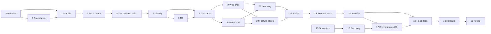

# Sadhana Yog Command Center — Implementation Roadmap

Status: Proposed execution plan; no application implementation has begun  
Date: 2026-08-19  
Companion: [Engineering foundation](../architecture/engineering-foundation.md)

## 1. How to execute this roadmap

Stages 0–20 are outcome gates, not necessarily release sprints. Each stage is an Epic. The numbered work packages are intended to become the child issue files listed in Section 24. An issue may begin only when its `blocked_by` issues are Done and its human decisions are recorded. Later stages may prepare documents in parallel, but implementation cannot bypass a prior architectural or data gate.

Every stage below explicitly states objective; prerequisites, inputs and dependencies; work; repository/files, database, API, Flutter, web and infrastructure effects; decisions; tests; security; documentation; agent tools; exit/Definition of Done; risk; and rollback. “None” is intentional when a layer must not change.

Priorities mean: P0 active incident/data loss; P1 required for safe initial release; P2 required but not on the immediate critical path or deferrable release scope; P3 opportunistic. The product owner, not an autonomous agent, owns priority changes.

## 2. Stage 0 — Discovery and baseline

### Objective

Create an evidence-backed, signed-off behavioral baseline from the two legacy applications without modifying them. Resolve which store is authoritative and turn material behavior into preservation requirements.

### Prerequisites, inputs and dependencies

- Inputs: Command Center revision `c724be0…`, Teaching Archive revision `c6732f5…`, current browser/Sheets exports, Apps Script and Worker configuration, user interviews.
- Dependency: none. This stage blocks domain, schema, migration, parity and feature work.
- Work must use read-only copies/exports; production browser/Sheets data cannot enter Git or agent prompts.

### Exact work items

1. **SY-0002 Repository and deployment baseline:** record file/dependency/build/deploy/test inventories, generator drift, environment assumptions, revisions and ownership.
2. **SY-0003 Command Center feature/workflow inventory:** document every page/tab/action, state transition, empty/loading/error behavior, shortcuts, responsive behavior and external deep link.
3. **SY-0004 Legacy data and rule inventory:** map `sadhanayog.v1`, Sheet columns, IDs, list/JSON encodings, calculation modules, derived sessions, outbox and last-write-wins behavior.
4. **SY-0005 Teaching Archive inventory:** catalogue content IDs/concepts, five navigation areas, journey phases, rituals, reviews, benchmarks, data shape, privacy wording and no-media invariant.
5. **SY-0006 Quality/security/accessibility baseline:** threat sketch, localStorage/Access/shared-key findings, CSP/DOM sinks, privacy data, keyboard/focus/semantics/responsive findings, and absence of tests.
6. **SY-0007 Preservation and source-of-truth sign-off:** interview 2–3 users, classify behavior as preserve/change/remove, decide browser vs Sheets precedence, capture sanitized representative exports/checksums, and approve the feature inventory.

### Expected repository changes

| Area | Change |
|---|---|
| Files/docs | create `docs/discovery/{repository-baseline,feature-inventory,legacy-data,teaching-archive,a11y-security-baseline,source-of-truth}.md` and sanitized fixture policy |
| Database | none |
| API | inventory current `/sync`; no new API |
| Flutter | none |
| Web | none; screenshots and navigation maps only |
| Infrastructure | none; document current Worker/Apps Script/DNS only |

### Decisions required

Approve the behavioral baseline, data source precedence, whether health notes are necessary, which legacy integrations are real versus demonstrative, and which low-value features may be deferred. Differences from the current UI must be explicit product decisions, not inferred cleanup.

### Testing, security, documentation and tools

- Run both generator consistency checks and record the existing stale Apps Script result without fixing it.
- Render desktop/mobile workflows, keyboard walkthrough, DOM/accessibility inspection, sample exports, and calculation probes. Begin sanitized characterization vectors.
- Redact names, phone/email, addresses, health notes, invoice identifiers, keys and URLs. Raw exports stay in an access-controlled temporary location and are destroyed per the approved handling plan.
- Skills/tools: repository search/Git, browser/Playwright read-only, `model-domain` for terminology extraction, `review-security-privacy`; no remote mutation MCP.
- Documentation is the deliverable and must cite revision/path/observation method.

### Exit criteria and Definition of Done

All pages, workflows, collections, external dependencies, deployment assumptions, security/a11y debt and Teaching Archive experiences are inventoried; a product owner signs the preserve/change/defer matrix and data-source precedence; sanitized fixtures can exercise critical rules; no legacy file changed.

### Risks and rollback

- Risk: hidden browser-only data or workflows. Mitigate with user walkthrough plus export/hash from every active device/store.
- Risk: documenting an accidental behavior as a requirement. Label observation separately from approved intent.
- Rollback: documentation-only; revert incorrect baseline through review while preserving the evidence history.

## 3. Stage 1 — Repository and engineering foundation

### Objective

Create the runnable monorepo skeleton, governance, agent system and CI foundation without implementing product behavior.

### Prerequisites, inputs and dependencies

- Depends on SY-0002 and approved engineering foundation.
- Inputs: tool versions, chosen Git remote/CI provider, contributor operating systems, source repositories as read-only references.
- Flutter SDK is absent on the inspected machine and must be pinned/validated.

### Exact work items

1. **SY-0009 Workspace/toolchain scaffold:** initialize Git if required; create `apps`, `packages`, `content`, `tools`; pin Node/pnpm/Flutter/Dart/Wrangler/Java; root scripts and lockfiles.
2. **SY-0010 Empty application/package scaffolds:** create compiling Worker, Vite/TanStack web, Flutter iOS/Android shell, contracts/db/config packages, without domain features.
3. **SY-0011 Code quality conventions:** formatters, ESLint/TypeScript strictness, Flutter lints, import boundaries, Conventional Commits, generated-file and dependency policies.
4. **SY-0012 Documentation and decision system:** create the hierarchy/owners/indexes, `.agents/notes` lifecycle/templates/validator, postmortem templates and runbook placeholders.
5. **SY-0013 Issue tracker:** implement config/schema/templates, stable IDs, DAG/state validation and deterministic `lint/show/next/move`; seed roadmap epics/issues.
6. **SY-0014 Agent instructions and skills:** root/scoped `AGENTS.md`; implement and validate the minimal skills defined in the foundation; add examples and trigger tests.
7. **SY-0015 MCP/tool configuration:** repository `.codex/config.toml`, read-only Context7/Cloudflare docs, specialized Playwright, documented GitHub/log/database permissions; secret references only.
8. **SY-0016 CI foundation:** PR workflows for docs/tracker/decision lint, secret scan, TS/Flutter lint/test/build smoke, generated drift and dependency policy; CODEOWNERS and PR template.
9. **SY-0017 Developer bootstrap:** safe local environment templates, synthetic seed/reset commands, troubleshooting and a clean-machine bootstrap verification.

### Expected repository changes

| Area | Change |
|---|---|
| Files/docs | create the target tree in foundation Section 5, root/scoped instructions, templates and CI |
| Database | empty Drizzle package and local D1 binding only; no product tables |
| API | health placeholder and typed binding/config boot only; no product routes |
| Flutter | default shell, test target and flavors/config shell only |
| Web | default shell, router/test setup only |
| Infrastructure | local bindings and non-production Wrangler configuration; no production resources |

### Decisions required

Approve CI host, exact tool versions, package licenses, whether a shared development environment is needed, and protected path reviewers. Record stack selections as implemented ADRs after scaffolds prove viable.

### Testing, security, documentation and tools

- Clean checkout bootstrap on Linux and one mobile build host; deterministic format/lint/test/build smoke.
- Tracker fixtures test cycles, invalid states and completion evidence. Skills pass `quick_validate` and representative trigger/use tests.
- CI permissions default read; fork PRs receive no secrets; artifacts exclude `.dev.vars`, D1/R2 data and signing files.
- Skills/tools: `record-decision`, `work-issue`, skill-creator workflow, Context7, Cloudflare docs; human approval for installing packages/network and CI changes.
- Document setup, commands, generated files, dependencies, troubleshooting, environment matrix and agent authority.

### Exit criteria and Definition of Done

A new contributor/agent can clone, bootstrap, run the three empty apps locally, run `verify`, create/validate an issue and ADR, and understand protected operations from documentation. CI is green from a clean checkout and no product feature has been implemented.

### Risks and rollback

- Risk: foundation overengineering. Enforce each tool's documented need; omit task orchestrators/custom dashboards.
- Risk: incompatible Flutter/native toolchain. Test real empty iOS/Android builds early.
- Rollback: scaffold/config changes are reversible. Keep foundation changes separated by concern and never mutate source repositories.

## 4. Stage 2 — Domain modeling

### Objective

Establish canonical business language, entities, invariants, states, ownership and permissions before persistence or feature API design.

### Prerequisites, inputs and dependencies

- Depends on SY-0003–SY-0007 and documentation/tracker foundation SY-0012–SY-0013.
- Inputs: approved behavior inventory, legacy schemas/rules, Teaching Archive content, user interviews, security data classes.

### Exact work items

1. **SY-0019 Domain glossary/context map:** define organization, user, instructor, student, program, package, class series/occurrence/override, course, enrollment, membership, attendance, invoice/payment/expense/payout, lead, task, communication, document and learning concepts; identify bounded modules.
2. **SY-0020 Identity/permission model:** separate login users from instructors/students; define ownership and owner/teacher/viewer permission matrix down to health, finance, exports, settings and documents.
3. **SY-0021 Scheduling/participation invariants:** recurrence, time zone/DST, cancellations/reschedules, capacity/waitlist, course progress, attendance uniqueness and membership consumption/refund rules.
4. **SY-0022 Finance/workflow invariants:** integer money/currency, invoice snapshots/state transitions/voiding, payment allocation, receivables, expenses/payouts, task/lead/message states and idempotency.
5. **SY-0023 Teaching Archive domain/content model:** stable content IDs/versioning, journey/day/return semantics, reflection/log/review/ritual/benchmark/progress entities, privacy and no-media behavior.
6. **SY-0024 Domain examples and parity skeleton:** executable-looking Given/When/Then examples, lifecycle diagrams, data classification and initial feature parity matrix across legacy/web/Flutter/API.

### Expected repository changes

| Area | Change |
|---|---|
| Files/docs | `docs/product/{glossary,workflows,feature-parity}.md`, `docs/architecture/{domain-model,authorization-model}.md`, security classification updates, proposed ADRs |
| Database | conceptual ER model only; no migrations |
| API | resource/action vocabulary and command/query candidates only |
| Flutter | screen/outcome map only |
| Web | route/outcome map only |
| Infrastructure | none |

### Decisions required

Product owner approves terminology, permission matrix, attendance/package rules, invoice corrections, health-data scope, archive privacy, time-zone/currency semantics and any legacy behavior intentionally changed. Human architecture approval transitions domain ADRs.

### Testing, security, documentation and tools

- Validate each invariant against sanitized legacy examples and edge cases: DST, duplicate attendance, expired/limited packages, partial payments, void invoices, archived students, content version change.
- Conduct IDOR/data-class review before finalizing ownership; permission denial examples are first-class acceptance criteria.
- Skills/tools: `model-domain`, `record-decision`, `review-security-privacy`; no schema/code generation yet.
- Glossary terms must be used consistently by roadmap, issues and later contracts.

### Exit criteria and Definition of Done

Every release-scope legacy feature maps to a domain module/entity/action; identities and permissions are explicit; invariants have examples and owner approval; unresolved points are blocking Spikes rather than TODO prose.

### Risks and rollback

- Risk: UI fields mistaken for entities or overloaded “class/package/member.” Mitigate with context map and examples.
- Risk: premature schema decisions. Keep this stage persistence-neutral.
- Rollback: revise proposed models/ADRs before implementation; after schema adoption use superseding ADRs, never rewrite history.

## 5. Stage 3 — Database foundation

### Objective

Implement a D1-compatible Drizzle schema, migration discipline and synthetic data foundation that enforce the approved model.

### Prerequisites, inputs and dependencies

- Depends on domain issues SY-0019–SY-0024, workspace SY-0009–SY-0011 and approved D1 conventions.
- Inputs: domain model, query/use-case inventory, data classification/retention decisions, sanitized shapes.

### Exact work items

1. **SY-0026 D1 schema conventions/harness:** SQLite dialect, ULID/text/time/date/money/enum/check conventions, local/test DB harness, Drizzle config and reviewed migration workflow.
2. **SY-0027 Identity/catalog schema:** organizations/users/memberships/invitations/sessions; programs/packages/class series/weekdays/overrides/courses/instructors/locations with ownership/FKs/indexes.
3. **SY-0028 Student/participation schema:** students/tags/enrollments/waitlist/memberships/attendance, uniqueness and archive/version fields.
4. **SY-0029 Finance/work/comms schema:** immutable invoice items, payments/allocations, expenses/payouts, leads/tasks/links/templates/message events/reminders/rules.
5. **SY-0030 Learning/files/system schema:** journey/reflection/log/review/ritual/benchmark/progress, object/document states, idempotency and audit events.
6. **SY-0031 Seed/fixture/query verification:** deterministic synthetic organizations/users/domain scenarios, fresh/upgrade migration tests, FK/invariant/query-plan checks and data dictionary.
7. **SY-0032 Migration operations:** expand/backfill/contract template, production gate, Time Travel bookmark/export/runbook and compatibility checklist.

### Expected repository changes

| Area | Change |
|---|---|
| Files/docs | `packages/db/src`, ordered SQL in `packages/db/migrations`, tests/fixtures; `docs/database/{conventions,data-dictionary,migrations}.md` |
| Database | create all foundational tables, constraints, indexes and migration ledger; no production DB |
| API | no product endpoints; repository interfaces/query prototypes may be tested internally |
| Flutter | none |
| Web | none |
| Infrastructure | named local/test D1 binding; dev/prod binding manifests without IDs/secrets |

### Decisions required

Approve final tables/cascades, archive vs delete, audit granularity, invoice numbering, retention fields, index/query plan, session storage and whether any health fields require application encryption. Every schema family has a reviewed ADR or approved architecture reference.

### Testing, security, documentation and tools

- Apply migrations to empty DB and prior-version fixture; `PRAGMA foreign_key_check`; constraint failure tests; atomic `batch()` rollback; tenant-scoped repository negative tests; critical `EXPLAIN QUERY PLAN`.
- No real personal data. Every tenant table includes organization ownership and composite access indexes. Destructive SQL and unbounded updates are lint/review failures.
- Skills/tools: `change-d1-schema`, local Wrangler/D1, Drizzle docs, Cloudflare docs, `review-security-privacy`; no remote `push`.
- Data dictionary records purpose, sensitivity, owner, retention, nullability, constraints and API exposure.

### Exit criteria and Definition of Done

Fresh and upgrade migrations are deterministic and green; domain invariants are enforced at the strongest appropriate layer; synthetic seeds support later API/client work; reviewed SQL and recovery plan exist; D1/SQLite limitations are explicitly respected.

### Risks and rollback

- Risk: single-threaded D1/write hot spots or missing SQL features. Exercise realistic bounded transactions; keep repository boundaries portable.
- Risk: irreversible migration. Use expand/contract, compatibility tests and pre-action bookmarks/exports.
- Rollback: pre-production recreate local DB. Production later uses forward repair or human-approved Time Travel/restore with data-loss assessment.

## 6. Stage 4 — Backend foundation

### Objective

Create the secure Worker request pipeline, module boundaries, database access, error/logging conventions and foundational API behavior.

### Prerequisites, inputs and dependencies

- Depends on SY-0010–SY-0011, schema harness SY-0026/SY-0031 and approved API/identity direction. Product routes remain minimal until Stage 7/feature slices.
- Inputs: bindings/environment matrix, error taxonomy, permission model, OpenAPI conventions.

### Exact work items

1. **SY-0034 Worker composition/modules:** Hono bootstrap, typed environment, module registration, static asset fallback, request/context lifecycle and test harness.
2. **SY-0035 Validation/problem details:** Zod route validation, RFC-style problem responses, safe field errors, request IDs, content negotiation/body limits and version prefix.
3. **SY-0036 Principal/policy middleware:** normalized unauthenticated/test principal seam, organization membership lookup, permission policy API and tenant-scoped repositories; real OIDC follows Stage 5.
4. **SY-0037 D1 unit of work:** prepared queries, bounded atomic batches, optimistic concurrency, idempotency repository, retry classification and R2 compensation pattern interface.
5. **SY-0038 Security edge policy:** exact CORS/Origin/Fetch-Metadata, CSRF seam, security headers, rate-limit bindings/policies and cache rules.
6. **SY-0039 Observability/health foundation:** redacted structured logging, request timing/release metadata, liveness/readiness and consistent audit writer.
7. **SY-0040 Worker integration suite:** local bindings, fixture lifecycle, authz/validation/error/idempotency/transaction/header tests and static SPA routing.

### Expected repository changes

| Area | Change |
|---|---|
| Files/docs | `apps/api/src/{app,http,middleware,modules,observability}`, integration tests; API/error/security conventions docs |
| Database | session/audit/idempotency repositories exercised; no new schema outside reviewed migration issue |
| API | `/api/v1` skeleton, `/health/live`, protected readiness, standard problems; no broad CRUD |
| Flutter | none beyond generated-test compatibility placeholder |
| Web | static build served/fallback tested; no features |
| Infrastructure | local/dev binding declarations, rate limiter namespaces, assets routing; no production deploy |

### Decisions required

Approve routing library/version, problem format, request/response limits, rate-limit classes, readiness exposure, transaction abstraction and static asset routing. Confirm `run_worker_first` only for required route patterns.

### Testing, security, documentation and tools

- Unit/integration tests include malformed JSON, oversized bodies, unknown fields policy, cross-org IDs, missing/stale versions, duplicate idempotency key, batch failure, disallowed origin and redaction.
- Never treat route guard/client role as authorization. Repository signatures require organization scope. Log schema forbids body/header/token dumping.
- Skills/tools: `build-worker-api`, `review-security-privacy`, local Wrangler/Miniflare, Context7 and Cloudflare docs.
- Document middleware order, module boundary, errors, auth policy seam, local test strategy and binding ownership.

### Exit criteria and Definition of Done

The Worker runs locally with D1/assets, fails closed on invalid config/principals, returns stable safe errors, enforces tenant/policy seams, produces redacted request evidence and passes integration/security tests. No placeholder principal can compile into production configuration.

### Risks and rollback

- Risk: framework abstractions hide Worker/D1 behavior. Keep adapters thin and integration-test real bindings.
- Risk: permissive test auth leaks. Compile/runtime fail when test-auth flag is present outside local tests.
- Rollback: revert Worker foundation before production; DB changes remain independently compatible.

## 7. Stage 5 — Authentication and authorization

### Objective

Deliver the smallest secure, invite-only identity system shared by web and mobile, with authoritative application permissions and recoverable sessions.

### Prerequisites, inputs and dependencies

- Depends on permission model SY-0020, identity schema SY-0027, Worker principal/policy and edge seams SY-0036/SY-0038.
- Inputs: identity-provider Spike, user list, domains/callbacks, recovery owner, session/privacy requirements.

### Exact work items

1. **SY-0042 Managed OIDC decision Spike:** compare Auth0 against at least one standards-based provider for current cost, region, export, MFA/recovery, native SDK, web BFF and operational fit; approve provider ADR.
2. **SY-0043 Identity tenant/app configuration:** separate dev/prod tenants or isolated applications, web confidential/native public clients, exact callbacks/logout/audience/algorithms, invite-only/MFA/recovery policies and narrow admin access.
3. **SY-0044 Web BFF authentication:** state/nonce/PKCE transaction, code exchange in Worker, hashed opaque D1 session, hardened `__Host-` cookie, idle/absolute expiry, rotation, logout and CSRF.
4. **SY-0045 Mobile authentication:** system-browser Authorization Code+PKCE, deep/universal links, short tokens, rotating refresh tokens, Keychain/Keystore, logout/revocation and re-auth error handling.
5. **SY-0046 Account provisioning/authorization:** map external subject to user, invitation/allowlist flow, organization role/permission checks, disable/remove/role-change/session revocation, instructor linkage and audit.
6. **SY-0047 Identity threat/negative test suite:** token verification, callback attacks, session fixation/replay/CSRF, revoked/disabled/cross-org access, role matrix and device/session behavior.
7. **SY-0048 Recovery/admin runbook:** initial user onboarding, owner recovery, provider outage, compromised device/account, key/client-secret rotation and break-glass with human custody.

### Expected repository changes

| Area | Change |
|---|---|
| Files/docs | Worker auth module/routes/tests; Flutter auth service/state; web auth routes/state; authz matrix/threat model/runbooks; provider config templates |
| Database | use identity/invitation/session/membership/audit tables; migration only if Stage 3 gap is approved |
| API | `/auth/login`, callback, session, logout; bearer validation; invitation/account/session endpoints only as approved |
| Flutter | login/logout/session restore/re-auth shell and secure storage; no feature screens |
| Web | login/callback/error/logout and authenticated route shell; cookie not exposed to JS |
| Infrastructure | provider tenant/apps, secrets, callback DNS, separate environment configuration; human-created production resources |

### Decisions required

Human approval of provider/contract, MFA level, exact session lifetimes, refresh lifetime/rotation, roles/permissions, recovery and whether session/device management UI is necessary for three users.

### Testing, security, documentation and tools

- End-to-end web and device/emulator login/logout/expiry/refresh/revocation. Matrix every protected route against roles and wrong organization. Clock-skew/key-rotation/provider-outage cases.
- Validate issuer/audience/algorithm/JWKS; no client secret in web bundle/mobile; no raw session/token in D1/logs; callback URI exact; state/nonce/PKCE; session rotation and CSRF.
- Skills/tools: `review-security-privacy`, `build-worker-api`, `build-web-feature`, `build-flutter-feature`, provider docs; production identity actions require human approval.
- Document provider configuration without secrets, identity mapping, permission matrix, recovery/offboarding and test accounts.

### Exit criteria and Definition of Done

Only invited active members can obtain a principal; web and mobile sessions work and revoke; every protected endpoint performs application authorization; cross-organization and disabled-account tests fail safely; recovery/runbook drill succeeds; no local password database exists.

### Risks and rollback

- Risk: vendor price/region/SDK changes. Standards-based adapter and approved Spike; export subject/email mapping.
- Risk: lockout or stolen refresh token. Break-glass recovery, rotation/reuse detection, revocation and short access tokens.
- Rollback: disable new callbacks/client apps, revoke sessions/tokens and revert auth release. Never fall back to shared access key or bypass authorization.

## 8. Stage 6 — R2 document storage

### Objective

Implement an authorized, auditable document lifecycle without exposing buckets, credentials or client-chosen paths.

### Prerequisites, inputs and dependencies

- Depends on object schema SY-0030, authorization SY-0046, Worker foundation SY-0034–SY-0039.
- Inputs: approved document types, ownership/audience, maximum size, retention/deletion, malware/active-content policy and RPO.

### Exact work items

1. **SY-0050 Document policy decision:** enumerate allowed use cases/types/sizes, sensitive classes, ownership, viewer permissions, retention, quarantine/sanitize/force-download behavior and explicitly exclude Teaching Archive media.
2. **SY-0051 Private R2/environment setup:** local/dev/prod bucket plan, private binding, disabled `r2.dev`, generated opaque key convention, lifecycle/inventory configuration and least-privilege tokens.
3. **SY-0052 Upload state machine:** server-generated metadata/key, `pending → ready/failed`, size/MIME/extension/magic/checksum validation, timeout/idempotency, quota and compensating cleanup.
4. **SY-0053 Authorized download/version/delete:** resource-policy check, safe filename/content headers, document versions, range behavior if needed, audited delete/tombstone and restoration semantics.
5. **SY-0054 Reconciliation/cleanup:** scheduled expired-pending and orphan detection, idempotent deletion, checksum/inventory reporting and operator repair command.
6. **SY-0055 R2 adversarial/integration tests:** unauthorized/cross-org IDs, traversal/key injection, HTML/SVG/PDF active content, mismatch/oversize/partial retry, stale signed URL if later enabled, orphan and R2 failure.

### Expected repository changes

| Area | Change |
|---|---|
| Files/docs | `apps/api/src/modules/documents`, R2 adapter/tests, document policy and storage/reconciliation runbooks |
| Database | use `objects`/`document_versions` state, checksum, owner/resource, retention and audit; schema gaps via reviewed migration |
| API | create/upload/finalize or direct Worker upload, metadata/list/download/delete/restore endpoints under `/api/v1` |
| Flutter | transport/repository proof for upload/download only; feature UI waits for migration slices |
| Web | transport proof only; no unrestricted direct bucket calls |
| Infrastructure | private R2 per environment, lifecycle and cleanup schedule; production setup human-gated |

### Decisions required

Approve proxy upload limit, content policy/malware stance, document versioning, deletion grace, quotas, backup class and whether any file needs short presigned transfer. Large files trigger a later ADR, not an unbounded endpoint.

### Testing, security, documentation and tools

- Exercise local R2/miniflare and a protected development bucket with synthetic files. Confirm bytes and D1 state reconcile after every injected failure.
- Bucket credentials never reach clients; key contains no PII; every operation authorizes organization plus owning resource; signed capability never logged.
- Skills/tools: `handle-r2-object`, `review-security-privacy`, Cloudflare docs/local Wrangler; specialized security fixtures only.
- Document state machine, types/limits, safe rendering, lifecycle, cleanup, restore and operator evidence.

### Exit criteria and Definition of Done

Allowed synthetic documents upload/download/version/delete only for authorized users; disallowed/malformed content fails safely; orphan cleanup and reconciliation are repeatable; bucket is private; retention/backup/runbooks and negative tests are approved.

### Risks and rollback

- Risk: non-atomic D1/R2 operations. Explicit states, idempotency and compensating reconciliation.
- Risk: malicious active content. Force attachment or approved sanitizer/sandbox; never application-origin execution.
- Rollback: disable document routes/flag, preserve ready bytes and metadata, reconcile pending work. Bucket deletion is never an automated rollback.

## 9. Stage 7 — API and shared contract layer

### Objective

Turn foundational route conventions into a reproducible language-neutral contract/client pipeline used by both clients and all later vertical slices.

### Prerequisites, inputs and dependencies

- Depends on Worker errors/validation SY-0035, auth behavior SY-0044–SY-0047 and R2 route semantics SY-0052–SY-0053.
- Inputs: module commands/queries, pagination/filter/sort needs, error matrix, mobile compatibility window.

### Exact work items

1. **SY-0057 Contract package conventions:** Zod request/response/problem schemas, route metadata, examples, naming/nullability/date/money rules and no persistence-row leakage.
2. **SY-0058 Deterministic OpenAPI:** generate/validate/commit OpenAPI 3.1, stable operation IDs/tags/security schemes, breaking-change check and CI drift gate.
3. **SY-0059 Web API client:** typed same-origin fetch, problem decoding, abort/request ID/idempotency/version handling, auth-expiry behavior and test adapter.
4. **SY-0060 Dart client generation/mapping:** pin generator, deterministic committed transport package, DTO/domain mapping boundary, auth/request hooks and mocked transport.
5. **SY-0061 Collection/concurrency conventions:** opaque cursors, stable sorting, allowlisted filters, conditional writes/ETags, `409` reconciliation and retry rules.
6. **SY-0062 Contract compatibility suite:** schema examples, server conformance, web/Dart compile tests, current/previous fixture compatibility and generated diff review.

### Expected repository changes

| Area | Change |
|---|---|
| Files/docs | `packages/contracts`, committed OpenAPI, client generator config/output, API conventions/compatibility policy |
| Database | none |
| API | existing foundational/auth/document endpoints expressed through contract package; no broad feature routes |
| Flutter | generated transport package and mapping/test seam |
| Web | typed fetch/problem adapter/query integration seam |
| Infrastructure | CI contract generation/diff artifacts only |

### Decisions required

Approve OpenAPI generator/version, null/optional semantics, date/money encoding, error code registry, cursor format opacity, version header/support policy and which generated artifacts are committed.

### Testing, security, documentation and tools

- A contract example must validate against its schema and route response. Detect undocumented responses, breaking removals/type changes and generated Dart drift.
- OpenAPI reveals no internal schema, secrets or admin endpoints beyond intended consumers. Security schemes describe authentication but never sample real tokens.
- Skills/tools: `build-worker-api`, `build-web-feature`, `build-flutter-feature`, Context7, OpenAPI tooling, `review-change`.
- Document client regeneration, compatibility classification, deprecation and error handling.

### Exit criteria and Definition of Done

One command reproducibly generates a valid reviewed spec and Dart client; web and Flutter compile against it; foundational routes conform; compatibility checks block unapproved breaking change; DTO/domain separation is demonstrated.

### Risks and rollback

- Risk: generator churn/unidiomatic Dart. Pin version, wrap generated layer and review generator upgrades separately.
- Risk: contract becomes database mirror. Enforce explicit DTO review and examples.
- Rollback: revert additive spec/client change. Published breaking contracts require compatibility restoration, not merely generator rollback.

## 10. Stage 8 — Flutter application foundation

### Objective

Build a maintainable, adaptive, accessible mobile shell that can receive vertical feature slices without global-state or transport coupling.

### Prerequisites, inputs and dependencies

- Depends on Stage 1 Flutter scaffold, authentication Stage 5 and Dart contract/client Stage 7.
- Inputs: information architecture/parity skeleton, design tokens, platform accounts/callbacks, supported OS/device matrix.

### Exact work items

1. **SY-0064 Flutter composition:** `app/core/features` boundaries, constructor DI/provider, environment/flavors, clocks/IDs/logger and architecture tests.
2. **SY-0065 Navigation/deep links:** `go_router` authenticated shell, adaptive navigation, redirect/restore behavior, not-found and universal/app link handling.
3. **SY-0066 Networking/repositories:** generated transport adapter, Result/failure taxonomy, cancellation/timeouts/retry/idempotency, auth refresh and injected fakes.
4. **SY-0067 State and local persistence policy:** view-model/command convention, loading/empty/error/conflict states, secure storage and allowlisted cache/draft storage with logout clearing.
5. **SY-0068 Mobile design system:** tokens, typography, controls, forms, feedback, list/table/card patterns, responsive breakpoints, platform adaptations, dark/light/reduced motion.
6. **SY-0069 Accessibility/localization foundation:** Semantics/focus/text scaling/contrast/touch targets/keyboard-switch, date/number/time-zone services and externalized strings (English first).
7. **SY-0070 Flutter test/build harness:** unit/widget/golden/router/DI/integration scaffolds, synthetic auth, iOS/Android debug/release smoke and CI artifacts.

### Expected repository changes

| Area | Change |
|---|---|
| Files/docs | `apps/mobile/lib/{app,core,features}`, test harness, platform config; mobile architecture/design/accessibility/test docs |
| Database | none |
| API | no new feature routes; exercise health/session only |
| Flutter | full authenticated application shell and reusable states/components; no migrated product feature |
| Web | none |
| Infrastructure | dev/prod mobile flavor values, callbacks and CI build setup; signing still human-controlled |

### Decisions required

Approve minimum iOS/Android versions, Provider/MVVM implementation, device/tablet scope, orientation, deep links, cache/draft data classes, design tokens and golden-test policy.

### Testing, security, documentation and tools

- Tests cover bootstrap config failure, DI, auth redirect/refresh/logout, deep links, offline/timeout/errors, duplicate command, text scale, screen size, dark/reduced motion and semantics.
- No secret/client secret in binary; refresh material only secure storage; minimize sensitive cache/backups/logs/screenshots; clear organization data on logout.
- Skills/tools: `build-flutter-feature`, `audit-accessibility-parity`, Flutter analyzer/test/device tooling, Context7; official samples inform, never copied blindly.
- Document layer/import rules, state conventions, device commands, flavors/signing boundary and accessibility checklist.

### Exit criteria and Definition of Done

Both platform shells authenticate against development, navigate adaptively, render all standard states, meet baseline semantics/text-scale checks, use fakes in tests and produce debug/release smoke builds with no product feature implied.

### Risks and rollback

- Risk: dependency/state framework churn. Minimize packages and hide external APIs behind narrow seams.
- Risk: design system built too abstractly. Implement only components required by shell/first slices.
- Rollback: revert shell package changes; identity/API remains independent. Never revoke production signing assets as code rollback.

## 11. Stage 9 — TanStack web application foundation

### Objective

Build an accessible, responsive, authenticated TanStack SPA shell with deliberate server-state, form and error behavior.

### Prerequisites, inputs and dependencies

- Depends on Stage 1 web scaffold, web BFF Stage 5 and web client Stage 7.
- Inputs: information architecture/parity skeleton, design tokens, browser support and CSP policy.

### Exact work items

1. **SY-0072 Web composition/routes:** Vite/React strict setup, feature folders, generated TanStack route tree, authenticated layout, lazy boundaries, 404 and error boundaries.
2. **SY-0073 Query/data conventions:** Query client defaults, route-loader prefetch, keys, mutation/invalidation/cancellation, retry/offline/degraded policy and devtools restrictions.
3. **SY-0074 Forms/errors:** TanStack Form + Zod mapping, server field/problem errors, duplicate-submit prevention, dirty-leave behavior and accessible feedback.
4. **SY-0075 Web design system:** tokens, semantic controls/forms/dialogs/navigation/table/card/feedback, responsive side/bottom navigation, dark/light/reduced motion.
5. **SY-0076 Web security/accessibility shell:** CSP/header integration, no unsafe HTML, focus/keyboard/skip/navigation restoration, axe and responsive patterns.
6. **SY-0077 Web test/E2E harness:** Testing Library/Vitest/MSW-or-fetch fakes, Playwright synthetic auth, desktop/mobile viewports, a11y and build/static routing checks.

### Expected repository changes

| Area | Change |
|---|---|
| Files/docs | `apps/web/src/{app,routes,features,components,styles,test}`, `e2e`; web architecture/design/a11y/test docs |
| Database | none |
| API | no feature endpoints; exercise session/health |
| Flutter | none |
| Web | full authenticated responsive shell and standard states; no migrated product feature |
| Infrastructure | Worker static asset/CSP/cache integration and web CI artifact |

### Decisions required

Approve supported browsers, router/query/form versions/defaults, layout breakpoints, table strategy, CSP, session-expiry UX and whether any public route exists.

### Testing, security, documentation and tools

- Unit/E2E tests cover direct/deep URL, auth redirect/logout/expiry, 404/errors, offline/degraded notice, keyboard navigation, modal focus, axe, reduced motion and mobile overflow.
- Same-origin cookie only; CSRF attached by client; route guard is UX; user content never reaches `innerHTML`; source maps/access controlled as decided.
- Skills/tools: `build-web-feature`, `audit-accessibility-parity`, Playwright MCP local/dev, Context7.
- Document route/query/form/component conventions, browser commands and accessibility protocol.

### Exit criteria and Definition of Done

The static web build is served by the Worker, authenticates, navigates and handles all standard states across target viewports; CSP/keyboard/axe tests pass; no product feature is falsely complete.

### Risks and rollback

- Risk: Router and Query duplicate caching. Router coordinates; Query owns shared server data; conventions/tests enforce this.
- Risk: legacy dense UI copied without responsive IA. Use outcome parity, not pixel parity.
- Rollback: revert web artifact independently while API remains backward compatible.

## 12. Stage 10 — Feature migration

### Objective

Migrate every approved Command Center capability as secured vertical slices with backend, D1, Flutter and web parity, using characterization evidence rather than a big-bang client rewrite.

### Prerequisites, inputs and dependencies

- Depends on approved Stage 0 inventory/model, Stages 3–9 foundations, and a parity row/ready issues for each slice.
- Inputs: sanitized fixtures, approved scope, designs, contracts and legacy behavior references.

### Exact work items

The migration order reduces dependency and financial risk. Each numbered item is an Epic/Feature group and must be decomposed into API/domain, web, Flutter, parity/test and migration-transform child issues before Ready.

1. **SY-0079 Organization/settings/catalog:** business settings, programs, packages, instructors and locations; replace local settings and establish shared selectors.
2. **SY-0080 Student CRM:** students, tags, profile/history, attention/archive states, privacy-sensitive notes and search/filter.
3. **SY-0081 Classes/courses/calendar:** class series, recurrence/overrides, courses, delivery/meeting/location, capacity/waitlist, calendar/time zone and session derivation.
4. **SY-0082 Membership/enrollment/attendance:** enrollments, package state, course progress, roster, attendance consumption/idempotency/corrections and alerts.
5. **SY-0083 Invoices/payments/receivables:** invoice line snapshots, draft/issue/send/open/paid/void, allocations, balance/aging, print and UPI display.
6. **SY-0084 Expenses/payouts/reports:** income/expense/profit/cashflow, payouts, utilization/growth/retention reports, date filters, CSV/print and reconciliation.
7. **SY-0085 Leads/tasks/automation:** enquiry/trial/conversion, My Day/repeat tasks, rule idempotency, approval/preview and safe background execution.
8. **SY-0086 Communications/reminders:** templates/audiences, WhatsApp/mail/SMS deep links, event log, quiet hours; preserve “opened,” never claim external delivery.
9. **SY-0087 Places/search/navigation utilities:** coordinates/distance/directions, global search, shortcuts/deep links and cross-resource navigation with privacy guards.
10. **SY-0088 Data import/export and cutover tooling:** read-only legacy extraction, deterministic validation/transform/import, run IDs, dry-run/reconciliation, immutable raw backup and no dual write.

For every feature group, issues must state: original behavior/reference; target entities/rules; route/permission/errors/idempotency; migration/DB change; Flutter screens/states; web routes/states; validation; empty/loading/error/conflict/offline behavior; tests/a11y; deprecation and rollback.

### Expected repository changes

| Area | Change |
|---|---|
| Files/docs | module/feature code and tests in all apps/packages; product workflows/parity/API/data dictionary; import tools and reconciliation reports |
| Database | only approved additive migrations/query/index changes; legacy transformation into canonical tables |
| API | resource/action endpoints under `/api/v1`, stable problem codes, idempotent commands and report/export jobs as justified |
| Flutter | native adaptive screens/view models/repositories for every release-scope feature |
| Web | semantic responsive routes/forms/tables/reports for same outcomes |
| Infrastructure | scheduled automation only after idempotency; bounded export artifacts; feature flags if temporary |

### Decisions required

Approve slice-specific workflow changes, report formula definitions, automation scheduling/communication truth, print/CSV scope, sensitive field permissions and defer list. Any changed legacy rule needs product decision/ADR before implementation.

### Testing, security, documentation and tools

- Characterization/domain/API/DB/client/E2E tests per slice; money/date/attendance property/fixture tests; cross-org/role negative matrix; migration dry-run and reconciliation.
- Protect health/finance/export/search data; server-side filter/authorization; formula injection-safe CSV; no client-authoritative calculations or automation delivery claims.
- Skills/tools per slice: `work-issue`, `model-domain`, `change-d1-schema`, `build-worker-api`, both client skills, `audit-accessibility-parity`, Playwright and local Wrangler.
- Update feature inventory/parity, workflow, API, schema, security, test and operator docs with each slice.

### Exit criteria and Definition of Done

Each approved Command Center feature is either parity-complete with traceable evidence or explicitly deferred by product decision; calculations reconcile to legacy fixtures; all roles/platform states are tested; import rehearsal is deterministic; legacy remains unchanged/read-only until cutover.

### Risks and rollback

- Risk: big-bang scope and client divergence. Deliver thin vertical slices and close only with parity matrix.
- Risk: data/formula drift. Characterization vectors, dual calculation comparison during rehearsal and owner reconciliation.
- Rollback: flags/route compatibility permit slice disable; migrations remain backward compatible; cutover rollback returns to read-only legacy only within the approved window and restores raw data without dual writes.

## 13. Stage 11 — Teaching Archive integration

### Objective

Make the self-documentation journey a first-class, private, native cross-platform area while preserving its simplicity, content intent and no-media default.

### Prerequisites, inputs and dependencies

- Depends on Teaching Archive inventory/domain SY-0005/SY-0023, identity, content pipeline foundation and both client shells. May run alongside late Stage 10 slices in non-overlapping feature directories.
- Inputs: reviewed prose/content, legacy archive export, stable-ID/content-version design, retention/privacy decision.

### Exact work items

1. **SY-0090 Canonical content migration:** extract GUIDE/WEEK1/PLAN/RITUALS/frames/station/review fields/types to validated versioned JSON/Markdown with stable IDs, attribution and editorial diff.
2. **SY-0091 Learning persistence/API:** journeys, daily reflections, recording metadata, class reviews, ritual completions, benchmarks and content progress; per-user privacy, optimistic versions and import contract.
3. **SY-0092 Web Learning experience:** Today, Log, Rituals, Guide and Plan routes with search/checklists/reviews/progress/export/erase and main Today integration.
4. **SY-0093 Flutter Learning experience:** native equivalent navigation/rendering, locally bundled readable content, controlled drafts/sync and platform accessibility.
5. **SY-0094 Archive import/content migration:** transform `teaching-archive.v1`, stable-ID/version migration, returns/journey-day preservation, dry run and user reconciliation.
6. **SY-0095 Learning privacy/parity tests:** no-media enforcement, per-user isolation, retention/erase/export, content link/ID/schema, progression/ritual dates, web/mobile all-state and accessibility tests.

### Expected repository changes

| Area | Change |
|---|---|
| Files/docs | `content/teaching-archive`, validation/build tooling, learning module/features/tests, content/version/privacy docs |
| Database | learning tables from Stage 3 used; additive gap migration only |
| API | `/api/v1/learning/*` progress/entry/review/ritual/benchmark/import/export/erase routes |
| Flutter | native Learning area and Today prompt; bundled content renderer |
| Web | native Learning routes and Today prompt; no iframe |
| Infrastructure | content build artifact/cache; no R2 media bucket/use implied |

### Decisions required

Approve edited content, name/navigation in main app, whether any reflections are visible to another role, data retention/erase, offline draft conflict policy and exact legacy import semantics.

### Testing, security, documentation and tools

- Snapshot/schema/link/version tests, known-day/journey/ritual calculation vectors, import repeatability, isolation/export/erase and cross-client accessibility/parity.
- Reflections private by default, excluded from broad search/logs; no class recordings uploaded; privacy guidance is content and enforcement is separately tested.
- Skills/tools: `model-domain`, both client skills, `build-worker-api`, `audit-accessibility-parity`, content validator, Playwright.
- Document content authoring/version/migration, privacy, navigation, offline draft policy and user export/erase.

### Exit criteria and Definition of Done

All approved content and five workflows render natively on both platforms; stable IDs/version migrations work; legacy progress imports and reconciles; personal entries are isolated; no iframe or media upload exists; users approve conceptual continuity.

### Risks and rollback

- Risk: prose/meaning lost by extraction. Editorial diff and user sign-off against pinned legacy revision.
- Risk: private reflection exposure. Separate authorization/search/log policy and negative tests.
- Rollback: ship previous content manifest/client; retain server entries and compatible IDs. Disable main navigation without deleting learning data.

## 14. Stage 12 — Cross-platform feature parity

### Objective

Convert “feature parity” into explicit, testable outcome equivalence across legacy, web, iOS and Android, allowing intentional platform adaptation.

### Prerequisites, inputs and dependencies

- Begins during each Stage 10/11 slice and closes only after all release-scope features exist.
- Inputs: feature inventory, product workflows, contracts, permission matrix, supported-device/browser matrix and documented platform differences.

### Exact work items

1. **SY-0097 Parity matrix completion:** one row per action/view with behavior, validation, role, loading/empty/error/conflict/offline, documents, deep links, accessibility and responsive/platform expectations.
2. **SY-0098 Cross-client contract scenarios:** shared language-neutral Given/When/Then fixtures and API state builders for critical workflows.
3. **SY-0099 Parity audit and remediation:** paired web/mobile walkthroughs, defect/defer issue creation, product approval for intentional differences and regression ownership.
4. **SY-0100 Parity release gate:** CI/report links, zero unexplained gaps, supported-version matrix and sign-off process.

### Expected repository changes

| Area | Change |
|---|---|
| Files/docs | completed `docs/product/feature-parity.md`, shared scenario fixtures, audit reports/issues and release gate |
| Database | none except defects through separate migration issues |
| API | contract gaps fixed in linked issues, never ad hoc here |
| Flutter | parity defects/intentional platform adaptations through linked issues |
| Web | parity defects/responsive adaptations through linked issues |
| Infrastructure | CI publishes parity/test evidence only |

### Decisions required

Product approves intentional differences such as platform chrome, native sharing/file pickers, keyboard shortcuts and web print. Offline expectations must be explicit per feature; silence means online-required with a clear degraded state.

### Testing, security, documentation and tools

- Execute matching scenarios with the same seed/API state. Include roles, wrong tenant, empty/loading/error/conflict, screen sizes/text scale, keyboard/screen reader and document flow.
- Parity cannot weaken a platform's security. Native convenience is never permission to bypass server controls.
- Skills/tools: `audit-accessibility-parity`, both client skills, Playwright, Flutter integration/device tests, `review-change`.
- Every difference links to an approved product decision or issue.

### Exit criteria and Definition of Done

Every release-scope row has evidence for web/iOS/Android or an approved, documented exception; no P1 parity bugs remain; matrix and automated scenario references are current.

### Risks and rollback

- Risk: visual sameness mistaken for outcome parity. Matrix tests behaviors and states, not pixels.
- Risk: audit arrives too late. Update it inside every feature issue.
- Rollback: defer a whole coherent feature on all platforms through product approval; do not silently ship one-platform capability.

## 15. Stage 13 — Testing completion

### Objective

Close cross-cutting test gaps, establish stable release suites and prove migrations/security-critical workflows beyond the per-feature tests already required.

### Prerequisites, inputs and dependencies

- Test harnesses exist from Stages 3–9; release-scope features and parity matrix are substantially complete.
- Inputs: risk map, coverage reports, escaped defect history, supported environment matrix and migration rehearsal.

### Exact work items

1. **SY-0102 Test coverage/risk audit:** map invariants/routes/permissions/platform workflows to evidence, identify gaps rather than chase a global percentage.
2. **SY-0103 Domain/API/DB release suite:** money/attendance/time-zone/property cases, all route authz/errors/idempotency, fresh/upgrade migrations and query constraints.
3. **SY-0104 Flutter release suite:** view-model/widget/router/semantics, iOS/Android integration smoke, lifecycle/network interruption and performance budgets.
4. **SY-0105 Web/Playwright release suite:** supported browsers/viewports, keyboard/axe, auth/session, critical workflows, downloads/print and responsive overflow.
5. **SY-0106 Migration/recovery test suite:** legacy transform repeatability, partial failure/resume prevention, reconciliation and safe rollback/restore rehearsal.
6. **SY-0107 Flake/performance governance:** retry-free baseline, quarantine policy with expiry/issue, suite timing, seed determinism and selected response/render budgets.

### Expected repository changes

| Area | Change |
|---|---|
| Files/docs | tests/fixtures/builders across apps/packages; coverage/risk matrix, manual protocols and performance/flake policy |
| Database | test-only fixtures/migration versions; no production schema without linked issue |
| API | testability fixes and stable synthetic builders only |
| Flutter | test IDs/semantics where user-facing meaning supports them; no test-only production bypass |
| Web | test helpers/semantic selectors; no brittle implementation selectors |
| Infrastructure | CI sharding/artifact retention and protected synthetic environments if justified |

### Decisions required

Approve critical workflows, browser/device matrix, performance thresholds, test artifact retention and release suite duration. Coverage exceptions need owner/rationale.

### Testing, security, documentation and tools

This stage's output is test evidence. Security negative tests run without production credentials/data. Screenshots/traces are scrubbed and retained briefly.
- Skills/tools: all platform skills, Playwright, local Wrangler, `review-security-privacy`, `review-change`.
- Document how to reproduce every suite and diagnose flakes/failures.

### Exit criteria and Definition of Done

The risk matrix has no unexplained P1 gaps; release suites pass repeatedly from clean state without hidden retries; migration tests reconcile; manual device/a11y protocols have recorded evidence; flake issues have owners/expiry.

### Risks and rollback

- Risk: slow/brittle end-to-end pyramid. Keep domain/API-heavy coverage and only critical E2E paths.
- Risk: test bypass differs from production auth. Use provider test tenant or signed test seam impossible in production config.
- Rollback: revert unstable test infrastructure only with equivalent coverage and a tracked replacement; never simply remove a failing valid assertion.

## 16. Stage 14 — Security hardening

### Objective

Perform a dedicated threat-based release review, remediate findings and produce accepted residual risk without claiming regulatory compliance.

### Prerequisites, inputs and dependencies

- Depends on near-complete features, R2, auth, tests, deployment design and data classification.
- Inputs: threat model, route/permission/file inventory, dependency manifests, mobile/web builds, Cloudflare/provider configs and legal/privacy assessment status.

### Exact work items

1. **SY-0109 Threat model refresh:** assets/actors/trust boundaries/abuse cases for auth, organization access, files, exports, automation, clients, CI/agents/backups.
2. **SY-0110 Authorization/IDOR review:** enumerate every route/resource action and prove tenant/role/ownership denials, indirect object and search/report/export isolation.
3. **SY-0111 Web/API hardening:** injection/XSS/CSRF/CORS/CSP/headers/cache, validation/mass assignment, session/token, rate limits and error/log leakage.
4. **SY-0112 Upload/data/privacy hardening:** malicious files, signed capabilities, health/finance/reflection exposure, retention/export/erase/audit and backup access.
5. **SY-0113 Mobile/supply-chain hardening:** secure storage, binary config, backups/screenshots/clipboard/deep links, dependencies/licenses/provenance, CI secrets/permissions and signing.
6. **SY-0114 Remediation and residual-risk gate:** severity-ranked Bugs, owner/due date, retest evidence, accepted P2/P3 residual risks and production blockers.

### Expected repository changes

| Area | Change |
|---|---|
| Files/docs | refreshed threat model, findings/issues, hardened code/config/tests, privacy/legal applicability record and security review report |
| Database | least-privilege/query/audit/retention remediation through reviewed migrations |
| API | authz/validation/rate/error/header fixes; no unversioned behavior break |
| Flutter | storage/deep-link/log/display hardening |
| Web | CSP/DOM/cookie/CSRF/cache/accessibility-related security fixes |
| Infrastructure | token/role/binding/WAF/rate/log retention hardening through human-reviewed changes |

### Decisions required

Human security/product owners accept residual risk, privacy/legal scope, retention and any control tradeoffs. P0/P1 findings block release; agents cannot waive them.

### Testing, security, documentation and tools

- Reproduce and retest every finding; dependency/secret scans; tenant fuzz matrix; safe DAST against local/dev only; mobile artifact inspection; Cloudflare/provider configuration review.
- Use synthetic data/accounts. Do not run destructive or high-volume tests on production.
- Skills/tools: `review-security-privacy`, both client/API/R2 skills, dependency tools, Playwright/local scanners; specialized restricted access only.
- Document practices versus privacy requirements versus actual legal obligations.

### Exit criteria and Definition of Done

No open P0/P1 security/privacy finding; P2/P3 risks are explicitly owned/accepted; tenant/file/session controls have negative test evidence; secrets/dependencies/config reviewed; legal/compliance claims remain accurate and bounded.

### Risks and rollback

- Risk: checklist review misses business authorization. Route/resource matrix and abuse-case testing.
- Risk: hardening breaks mobile compatibility. Additive/compatible fixes and regression suites.
- Rollback: never roll back to a known exploitable release; disable feature/access, revoke sessions/tokens or forward-fix.

## 17. Stage 15 — Observability and operations

### Objective

Provide enough redacted evidence, alerting and runbooks to detect and diagnose failures without enterprise observability overhead.

### Prerequisites, inputs and dependencies

- Depends on Worker logging foundation, stable error codes, deployment environments and operational workflows.
- Inputs: failure modes, on-call/contact owner, privacy retention, Cloudflare plan capabilities and provisional SLO expectations.

### Exact work items

1. **SY-0116 Logging/audit completion:** structured schema, release/request correlation, redaction tests, route-level events and audit query/export policy.
2. **SY-0117 Metrics/alerts:** 5xx/latency/auth/rate/D1/R2/migration/deployment signals, low-noise thresholds and notification owner.
3. **SY-0118 Health/deployment visibility:** liveness/readiness, release/version endpoint protection, deployment/migration ledger and smoke status.
4. **SY-0119 Operational runbooks:** API/auth/provider/D1/R2 outage, suspected compromise/data exposure, failed automation, mobile release, user support and escalation.
5. **SY-0120 Operations drill:** inject safe dev failures, trace request ID, use alert/runbook, verify redaction and create findings.

### Expected repository changes

| Area | Change |
|---|---|
| Files/docs | logging/alert config, dashboards or saved queries, runbooks, drill report and operator checklist |
| Database | audit/migration/deploy query/index changes if reviewed; no log warehouse |
| API | health/version and structured event refinements |
| Flutter | safe client error/request ID display/report path |
| Web | safe client error/request ID display/report path |
| Infrastructure | Cloudflare observability/alerts/log retention; optional Sentry only through later ADR |

### Decisions required

Approve signal thresholds, recipients, retention/access, what constitutes an incident and whether current tooling shows a measured need for third-party error reporting.

### Testing, security, documentation and tools

- Redaction property/snapshot tests; synthetic alert and dependency-failure drills; ensure health does not expose secrets/schema and audit access is authorized.
- Skills/tools: `manage-release-incident`, `review-security-privacy`, restricted read-only platform logs/Cloudflare docs.
- Every alert links to a runbook and owner; every runbook names safe/approval-required actions.

### Exit criteria and Definition of Done

A safe dev drill is detected, correlated, diagnosed and closed using documented tools; logs contain no prohibited data; critical alerts have owners/runbooks; deployment/migration visibility is queryable.

### Risks and rollback

- Risk: PII leakage or alert fatigue. Allowlisted fields, redaction tests and tune from drills.
- Rollback: disable an unsafe event sink and preserve minimal Cloudflare metrics; do not disable security audit collection without approved substitute.

## 18. Stage 16 — Backup and recovery

### Objective

Implement, document and prove restoration of data, objects, configuration and operational access against accepted RPO/RTO.

### Prerequisites, inputs and dependencies

- Depends on stable D1/R2 schema, retention policy, environment security and operations ownership.
- Inputs: accepted RPO/RTO, D1 Time Travel plan window, object criticality, separate backup location/account and recovery custodians.

### Exact work items

1. **SY-0122 Backup policy/ownership:** classify D1/R2/config/identity/signing/secrets, retention/location/encryption/access, RPO/RTO and restore authority.
2. **SY-0123 D1 backup/export:** Time Travel bookmarks before changes, scheduled logical export beyond window, checksum/encryption/access and failure alert.
3. **SY-0124 R2 backup/version/inventory:** document version policy, lifecycle, checksum inventory and periodic independent copy for critical objects.
4. **SY-0125 Configuration/access recovery:** Git/config inventory, DNS/Cloudflare/provider/CI/mobile-signing custody, password-manager recovery and token rotation—not secret export.
5. **SY-0126 Restore/disaster drill:** restore clean D1 target where supported or controlled approved path, sample objects/checksums, app reconciliation/smoke, time measurement and remediation.

### Expected repository changes

| Area | Change |
|---|---|
| Files/docs | backup policy, scripts/workflow configs, inventories, restore/disaster runbooks and drill evidence |
| Database | export/check/restore tooling; no destructive production restore during routine CI |
| API | protected administrative reconciliation if justified; otherwise none |
| Flutter | post-restore smoke protocol only |
| Web | post-restore smoke protocol only |
| Infrastructure | scheduled exports, restricted backup buckets/location, alerts and recovery access |

### Decisions required

Product owner accepts RPO/RTO and cost; security approves backup geography/access/retention; humans approve any production restore or off-provider target.

### Testing, security, documentation and tools

- Quarterly restore drill with synthetic/dev or approved isolated copy; verify schema, row counts/invariants, object checksums, identity mapping and application smoke.
- Backup is at least as sensitive as source; no broad agent access; encrypt, audit, separate credentials and test expiry/deletion.
- Skills/tools: `manage-release-incident`, `change-d1-schema`, restricted Wrangler/rclone-like reviewed tooling; human gate for remote restore.

### Exit criteria and Definition of Done

Automated backups/exports are monitored; a documented restore completes within accepted RTO and meets RPO in a drill; object/config/access recovery is verified; findings have issues.

### Risks and rollback

- Risk: untested backup or same-account failure. Independent copies/inventory and regular drills.
- Risk: destructive Time Travel overwrites. Human approval, pre-restore bookmark/export and explicit database target verification.
- Rollback: restore the pre-action bookmark where supported or return to prior backup; document potential data loss before action.

## 19. Stage 17 — CI/CD and environments

### Objective

Turn CI foundations into an environment-isolated, review-gated promotion and mobile release pipeline that cannot confuse development and production resources.

### Prerequisites, inputs and dependencies

- Depends on green release suites, migration/backup runbooks, identity/R2/D1 environment plans and protected remote repository.
- Inputs: Cloudflare account, DNS, identity apps, Apple/Google accounts, signing custody and release roles.

### Exact work items

1. **SY-0128 Environment provisioning:** local/development/production and only justified staging; explicit Worker/D1/R2/auth/domain names, quotas/tokens and binding validation.
2. **SY-0129 CI required checks hardening:** complete path-aware checks, cache/artifacts/SBOM/provenance, minimal permissions, dependency/secret scan and branch protection.
3. **SY-0130 Worker/web pipeline:** immutable build, dev deploy/smoke, production environment approval, migration-before-app gate, digest/release recording and rollback.
4. **SY-0131 Database migration pipeline:** plan/list/dry-run evidence, exact target confirmation, pre-migration bookmark/export, human approval, apply/verify and forward-repair procedure.
5. **SY-0132 Flutter build/distribution:** reproducible signed iOS/Android builds, build numbers, TestFlight/internal Play channels, store metadata/privacy manifests and human submission.
6. **SY-0133 Secret/signing governance:** owners, environment scoping, rotation/revocation drill, fork isolation, no secret echo/artifact and emergency access.

### Expected repository changes

| Area | Change |
|---|---|
| Files/docs | production workflows/config templates, environment inventory, release/migration/signing docs, SBOM/provenance artifacts |
| Database | distinct DB IDs/bindings and gated migration execution |
| API | environment/release markers and production route deployment |
| Flutter | flavors, signing automation references and internal release artifacts |
| Web | immutable build included in Worker deployment |
| Infrastructure | real human-approved dev/prod resources, GitHub environments/protection, DNS and app distribution |

### Decisions required

Approve whether staging is worth the maintenance, deployment approvers, migration window, rollback owner, store distribution/legal metadata and release cadence.

### Testing, security, documentation and tools

- Pipeline tests prove dev cannot bind prod IDs and untrusted PR has no secrets; deploy dev and smoke; rehearse rollback and migration target guards; verify signed app identities/callbacks.
- Skills/tools: `manage-release-incident`, `change-d1-schema`, GitHub/Cloudflare tools restricted by role; every production write requires human approval.
- Document exact environment resource map without secret values and release/recovery responsibilities.

### Exit criteria and Definition of Done

One reviewed candidate promotes deterministically to development and a protected production rehearsal; wrong-environment attempts fail closed; migrations and mobile signing have approval/audit; rollback is rehearsed.

### Risks and rollback

- Risk: environment mix-up. Unique names/accounts where practical, typed binding manifests and runtime production assertions.
- Risk: signing/identity-store delay. Create owner accounts early and keep credentials human-controlled.
- Rollback: Worker version rollback with compatible schema; mobile phased/internal release and store rollback constraints documented; migrations use forward repair/restore gate.

## 20. Stage 18 — Production readiness

### Objective

Demonstrate that functionality, security, quality, data migration, recovery, operations, releases and human ownership are ready for real private users.

### Prerequisites, inputs and dependencies

- Depends on release-scope parity, green release tests, security gate, operations drill, recovery drill and deployment rehearsal.
- Inputs: readiness checklist, open issue/risk register, migration rehearsal report, app-store requirements and user acceptance.

### Exact work items

1. **SY-0135 Readiness evidence pack:** functionality/parity, tests/performance/a11y, security/privacy, environments/secrets, observability/runbooks, backups/recovery and mobile/web release evidence.
2. **SY-0136 Final migration rehearsal/UAT:** latest sanitized/controlled source export, deterministic import/reconciliation, timed cutover/rollback and 2–3 user acceptance on web/mobile.
3. **SY-0137 Final architecture/security review:** verify implemented system against foundation/ADRs, deviations/technical debt, residual risk and mobile API compatibility.
4. **SY-0138 Go/no-go and release checklist:** owners/timestamps/communications, release scope, known issues, freeze, backups, store builds, smoke and abort thresholds.

### Expected repository changes

| Area | Change |
|---|---|
| Files/docs | completed readiness/UAT/migration/architecture/security evidence, accepted risks and release checklist |
| Database | rehearsal only; production migration not yet run |
| API | release candidate frozen except approved blockers |
| Flutter | signed RC on internal channels |
| Web | immutable RC on protected development/staging |
| Infrastructure | alerts/backups/access verified; no production data cutover |

### Decisions required

Named humans approve go/no-go, known issues, residual risks, RPO/RTO, privacy/legal position, release users, cutover/rollback thresholds and legacy read-only window.

### Testing, security, documentation and tools

- Full release suite, manual assistive/device protocol, performance sample, security retest, restore evidence, UAT and migration reconciliation.
- Freeze secret/config changes; verify user list/roles and support/recovery contacts.
- Skills/tools: `review-change`, `review-security-privacy`, `audit-accessibility-parity`, `manage-release-incident`.
- Readiness document links immutable CI/deploy/build/issue evidence, not unsupported assertions.

### Exit criteria and Definition of Done

Every checklist item is passed, explicitly waived by authorized owner, or blocks launch; no P0/P1 bug/security finding; UAT and migration rehearsal pass; go/no-go is signed with rollback thresholds and owners.

### Risks and rollback

- Risk: checklist theater. Require direct evidence links and independent review.
- Risk: late architecture divergence. Record debt/ADR and block only material safety/correctness gaps.
- Rollback: no production change yet; defer launch or reduce coherent release scope across both clients.

## 21. Stage 19 — Initial production release

### Objective

Execute a controlled, observable cutover and private release with verified data, clients, user access and rollback readiness.

### Prerequisites, inputs and dependencies

- Depends on approved SY-0138 go decision and completed RC. Humans are present for migration, deploy, identity, mobile and user verification.
- Inputs: immutable artifacts/digests, raw legacy export, backups/bookmarks, release notes, user contacts and abort thresholds.

### Exact work items

1. **SY-0140 Release candidate freeze:** tag/version/build numbers, checksums/SBOM, known issues, contract/migration compatibility and final smoke.
2. **SY-0141 Legacy freeze/export:** announce write freeze, restrict legacy read-only, export each authoritative source, checksum/encrypt/store and verify source counts.
3. **SY-0142 Production migration/import:** verify exact target, bookmark/export D1, apply migrations, run idempotent one-time import, reconcile counts/relationships/balances/attendance/invoices/learning samples and obtain human sign-off.
4. **SY-0143 Production deploy/distribution:** promote Worker/web artifact, verify bindings/secrets/headers/health, release mobile internal builds to named users and keep store rollout controlled.
5. **SY-0144 Smoke/user verification/monitoring:** role login/logout, Today, attendance, invoice/payment view, document flow, learning entry, export/critical reports on web/iOS/Android; monitor defined signals.
6. **SY-0145 Release closeout:** record actual timeline/deviations, user confirmation, known issues, legacy validation-window state, follow-ups and 24–72 hour review.

### Expected repository changes

| Area | Change |
|---|---|
| Files/docs | release record/checklists/reconciliation/known issues and follow-up issues; no ad hoc source edits during release |
| Database | production migrations and one-time audited import |
| API | production release promotion |
| Flutter | signed release distributed to named users |
| Web | production artifact promoted |
| Infrastructure | production bindings/routes/alerts active; legacy read-only/access-restricted |

### Decisions required

At each gate a human decides continue/abort based on thresholds. Only product/data owner accepts reconciliation; only release owner deploys; only authorized account owners distribute mobile builds.

### Testing, security, documentation and tools

- Execute scripted smoke with synthetic/approved real records and validate request IDs/alerts. Do not “test” destructive operations on real records.
- No raw export in logs/artifacts; release participants use least privilege; revoke temporary access/tokens after closeout.
- Skills/tools: `manage-release-incident`, restricted GitHub/Cloudflare/provider/store tooling, migration scripts; production writes never autonomous.
- Record commands/results/timestamps without secrets and link exact artifacts/commit/issues.

### Exit criteria and Definition of Done

Production data reconciles and is signed off; web/API healthy; named users authenticate and complete critical workflows on their platforms; monitoring/backup works; no abort threshold is crossed; known issues/follow-ups and legacy window are recorded.

### Risks and rollback

- Risk: import mismatch. Abort before enabling writes; fix transformer and repeat from clean target. Never patch unexplained totals manually.
- Risk: post-deploy auth/API failure. Roll back compatible Worker/web; revoke/reissue mobile candidate; preserve schema/data.
- Rollback to legacy is allowed only during agreed window after freezing new-system writes and reconciling any new records. Prefer forward fix; a D1 restore or DNS/identity reversal is human-approved and documented.

## 22. Stage 20 — Post-release iteration

### Objective

Operate a disciplined feedback, triage, maintenance, security and architecture-evolution loop after the initial release.

### Prerequisites, inputs and dependencies

- Begins after Stage 19 closeout and continues for product lifetime.
- Inputs: user feedback, logs/alerts, support observations, dependency/security notices, performance and incident evidence.

### Exact work items

1. **SY-0147 Feedback/triage cadence:** capture source/impact/reproduction, deduplicate, classify Bug/Feature/Debt/Spike, product-prioritize and protect sensitive user feedback.
2. **SY-0148 Release health review:** 24–72 hour and 30-day review of errors, auth, R2/D1, backups, performance, parity and migration/legacy retirement readiness.
3. **SY-0149 Legacy decommission:** after validation window and backup acceptance, revoke Apps Script/shared keys/Access paths, archive docs/artifacts and delete only through an approved checklist.
4. **SY-0150 Maintenance cadence:** weekly dependency review, monthly access/backup check, quarterly restore/security/privacy/agent-skill review and annual architecture/retention assessment.
5. **SY-0151 Incident/postmortem loop:** severity/notification, containment/recovery, qualifying blameless postmortem, remediation issues and guard updates.
6. **SY-0152 Architecture/backlog evolution:** measured debt/capacity evidence, new ADRs, API/mobile compatibility, roadmap updates and agent workflow quality review.

### Expected repository changes

| Area | Change |
|---|---|
| Files/docs | feedback/triage issues, health reviews, decommission evidence, maintenance calendar, ADRs/postmortems/runbook updates |
| Database | only through separately Ready database issues and the normal migration/release process |
| API | only through separately Ready contract/backend issues; maintain supported mobile compatibility |
| Flutter | feedback and defects become separately scoped Flutter/parity issues and internal release candidates |
| Web | feedback and defects become separately scoped web/parity issues and normal Worker/web releases |
| Infrastructure | maintenance, decommission and incident changes require their own approved infrastructure issues and gates |

### Decisions required

Humans prioritize feedback, approve legacy deletion, accept new architectural direction, define incident notifications and decide when scale evidence justifies infrastructure change.

### Testing, security, documentation and tools

- Every bug includes regression coverage; maintenance includes backup restore/security access/dependency checks; postmortem remediations are verified.
- Sensitive feedback/logs stay out of broadly readable issues; revoke stale accounts/tokens; re-evaluate retention and regulatory obligations.
- Skills/tools: `work-issue`, `record-decision`, `review-change`, `review-security-privacy`, `manage-release-incident`; external write tools remain role-restricted.
- Update docs in the same change as behavior and archive superseded guidance with links.

### Exit criteria and Definition of Done

This stage does not permanently “finish.” Each cadence completes with recorded evidence/issues; legacy is decommissioned only after its sub-issue gate; incidents close only after recovery and required remediations are tracked.

### Risks and rollback

- Risk: feedback becomes unstructured scope creep. Triage through product outcomes/dependencies and bounded issues.
- Risk: maintenance decays after a stable launch. Named calendar/owners and automated reminders.
- Rollback: revert individual compatible releases using normal controls; architecture changes require superseding ADR/migration paths, not history rewriting.

## 23. Issue hierarchy and direct-conversion rules

The canonical hierarchy is:

```text
Roadmap
└── Epic (one stage outcome)
    ├── Feature (user/domain capability or cross-platform outcome)
    │   ├── Task
    │   ├── Bug
    │   └── Technical Debt
    ├── Task (bounded foundation/operational work)
    └── Spike (time-boxed uncertainty ending in evidence/decision)
```

The issue IDs and titles in the stage work-item lists are canonical. The missing first ID of each stage is its Epic: SY-0001, 0008, 0018, 0025, 0033, 0041, 0049, 0056, 0063, 0071, 0078, 0089, 0096, 0101, 0108, 0115, 0121, 0127, 0134, 0139 and 0146 respectively.

To create files without interpretation, render each manifest row below using this deterministic rule:

- **ID/title/type/priority/parent/dependencies:** exactly the manifest row and the canonical work-item or stage title.
- **Objective:** the stage Objective, narrowed to the named work-item outcome.
- **Implementation requirements:** the exact work-item sentence plus the applicable cells in Expected repository changes and all stage Decisions required. Explicitly copy non-applicable area as “None.”
- **Acceptance criteria:** a checkbox for every named result in the work-item and the applicable Stage exit criteria. A Feature-group issue in Stage 10 cannot become Ready until its ten required per-feature dimensions are decomposed into child issues.
- **Testing/security/documentation:** copy the stage's corresponding subsection and narrow it to touched areas; never delete a required negative/security test.
- **Completion/DoD:** project-wide DoD plus every DoD code in the manifest, defined in Section 26.
- **Rollback:** copy the stage rollback and make target/artifact/data implications specific.
- **Architectural references:** this roadmap stage, foundation sections touched, domain/ADR/API/schema records.
- **Implementation notes/review evidence:** initially empty append-only headings; the implementer adds assumptions, commands, results, migrations and review links.

Thus every proposed issue has all requested fields even where the table avoids repeating long normative text. A tracker seeding script must implement this rule and its generated issue files must pass schema/link/DAG lint before merge.

### 23.1 Epic manifest

| ID | Title | Priority | Blocked by | Exit/DoD source |
|---|---|---:|---|---|
| SY-0001 | Stage 0 — Discovery and baseline | P1 | — | Stage 0 + DOC/SEC |
| SY-0008 | Stage 1 — Repository and engineering foundation | P1 | SY-0002 | Stage 1 + DOC/INFRA |
| SY-0018 | Stage 2 — Domain modeling | P1 | SY-0007, SY-0012 | Stage 2 + DOC/SEC |
| SY-0025 | Stage 3 — Database foundation | P1 | SY-0024, SY-0011 | Stage 3 + DB/SEC |
| SY-0033 | Stage 4 — Backend foundation | P1 | SY-0026, SY-0031 | Stage 4 + API/SEC |
| SY-0041 | Stage 5 — Authentication and authorization | P1 | SY-0020, SY-0036, SY-0038 | Stage 5 + API/FL/WEB/SEC |
| SY-0049 | Stage 6 — R2 document storage | P1 | SY-0030, SY-0046 | Stage 6 + API/INFRA/SEC |
| SY-0056 | Stage 7 — API and shared contract layer | P1 | SY-0035, SY-0047, SY-0055 | Stage 7 + API/FL/WEB |
| SY-0063 | Stage 8 — Flutter application foundation | P1 | SY-0045, SY-0060 | Stage 8 + FL/SEC |
| SY-0071 | Stage 9 — TanStack web application foundation | P1 | SY-0044, SY-0059 | Stage 9 + WEB/SEC |
| SY-0078 | Stage 10 — Feature migration | P1 | SY-0062, SY-0070, SY-0077 | Stage 10 + API/DB/FL/WEB/SEC |
| SY-0089 | Stage 11 — Teaching Archive integration | P1 | SY-0023, SY-0062, SY-0070, SY-0077 | Stage 11 + API/DB/FL/WEB/SEC |
| SY-0096 | Stage 12 — Cross-platform feature parity | P1 | SY-0088, SY-0095 | Stage 12 + FL/WEB/SEC |
| SY-0101 | Stage 13 — Testing completion | P1 | SY-0100 | Stage 13 + all touched DoDs |
| SY-0108 | Stage 14 — Security hardening | P1 | SY-0100, SY-0102 | Stage 14 + SEC |
| SY-0115 | Stage 15 — Observability and operations | P1 | SY-0039, release-scope API stable | Stage 15 + API/INFRA/SEC |
| SY-0121 | Stage 16 — Backup and recovery | P1 | SY-0054, SY-0116, retention approved | Stage 16 + DB/INFRA/SEC |
| SY-0127 | Stage 17 — CI/CD and environments | P1 | SY-0107, SY-0114, SY-0126 | Stage 17 + INFRA/SEC |
| SY-0134 | Stage 18 — Production readiness | P1 | SY-0100, SY-0107, SY-0114, SY-0120, SY-0126, SY-0133 | Stage 18 + all relevant DoDs |
| SY-0139 | Stage 19 — Initial production release | P1 | SY-0138 | Stage 19 + INFRA/DB/SEC |
| SY-0146 | Stage 20 — Post-release iteration | P2 | SY-0145 | Stage 20 + issue-specific DoD |

### 23.2 Child issue manifest: Stages 0–5

| ID | Canonical short title | Type | Pri | Parent | Blocked by | DoD |
|---|---|---|---:|---|---|---|
| SY-0002 | Repository and deployment baseline | Task | P1 | SY-0001 | — | DOC |
| SY-0003 | Command Center feature/workflow inventory | Task | P1 | SY-0001 | SY-0002 | DOC |
| SY-0004 | Legacy data and rule inventory | Task | P1 | SY-0001 | SY-0002 | DOC,SEC |
| SY-0005 | Teaching Archive inventory | Task | P1 | SY-0001 | SY-0002 | DOC |
| SY-0006 | Quality/security/accessibility baseline | Spike | P1 | SY-0001 | SY-0003,SY-0004,SY-0005 | DOC,SEC |
| SY-0007 | Preservation and source-of-truth sign-off | Spike | P1 | SY-0001 | SY-0003–SY-0006 | DOC,SEC |
| SY-0009 | Workspace/toolchain scaffold | Task | P1 | SY-0008 | SY-0002 | INFRA,DOC |
| SY-0010 | Empty application/package scaffolds | Task | P1 | SY-0008 | SY-0009 | API,FL,WEB |
| SY-0011 | Code quality conventions | Task | P1 | SY-0008 | SY-0009 | INFRA,DOC |
| SY-0012 | Documentation and decision system | Task | P1 | SY-0008 | SY-0009 | DOC |
| SY-0013 | Issue tracker | Feature | P1 | SY-0008 | SY-0012 | DOC |
| SY-0014 | Agent instructions and skills | Feature | P1 | SY-0008 | SY-0012,SY-0013 | DOC,SEC |
| SY-0015 | MCP/tool configuration | Task | P2 | SY-0008 | SY-0009,SY-0014 | INFRA,SEC,DOC |
| SY-0016 | CI foundation | Feature | P1 | SY-0008 | SY-0010–SY-0015 | INFRA,SEC |
| SY-0017 | Developer bootstrap | Task | P1 | SY-0008 | SY-0010,SY-0011 | INFRA,DOC |
| SY-0019 | Domain glossary/context map | Task | P1 | SY-0018 | SY-0003–SY-0005,SY-0012 | DOC |
| SY-0020 | Identity/permission model | Task | P1 | SY-0018 | SY-0006,SY-0019 | DOC,SEC |
| SY-0021 | Scheduling/participation invariants | Task | P1 | SY-0018 | SY-0003,SY-0004,SY-0019 | DOC |
| SY-0022 | Finance/workflow invariants | Task | P1 | SY-0018 | SY-0003,SY-0004,SY-0019 | DOC,SEC |
| SY-0023 | Teaching Archive domain/content model | Task | P1 | SY-0018 | SY-0005,SY-0019 | DOC,SEC |
| SY-0024 | Domain examples and parity skeleton | Task | P1 | SY-0018 | SY-0020–SY-0023 | DOC,SEC |
| SY-0026 | D1 schema conventions/harness | Task | P1 | SY-0025 | SY-0009–SY-0011,SY-0019,SY-0024 | DB,DOC |
| SY-0027 | Identity/catalog schema | Feature | P1 | SY-0025 | SY-0020,SY-0021,SY-0026 | DB,SEC |
| SY-0028 | Student/participation schema | Feature | P1 | SY-0025 | SY-0021,SY-0026 | DB,SEC |
| SY-0029 | Finance/work/comms schema | Feature | P1 | SY-0025 | SY-0022,SY-0026 | DB,SEC |
| SY-0030 | Learning/files/system schema | Feature | P1 | SY-0025 | SY-0023,SY-0026 | DB,SEC |
| SY-0031 | Seed/fixture/query verification | Task | P1 | SY-0025 | SY-0027–SY-0030 | DB |
| SY-0032 | Migration operations | Task | P1 | SY-0025 | SY-0031 | DB,INFRA,SEC,DOC |
| SY-0034 | Worker composition/modules | Task | P1 | SY-0033 | SY-0010,SY-0011,SY-0026 | API |
| SY-0035 | Validation/problem details | Feature | P1 | SY-0033 | SY-0034 | API,SEC |
| SY-0036 | Principal/policy middleware | Feature | P1 | SY-0033 | SY-0020,SY-0027,SY-0034 | API,SEC |
| SY-0037 | D1 unit of work | Task | P1 | SY-0033 | SY-0031,SY-0034 | API,DB |
| SY-0038 | Security edge policy | Task | P1 | SY-0033 | SY-0006,SY-0020,SY-0034 | API,INFRA,SEC |
| SY-0039 | Observability/health foundation | Task | P1 | SY-0033 | SY-0030,SY-0034 | API,INFRA,SEC |
| SY-0040 | Worker integration suite | Task | P1 | SY-0033 | SY-0031,SY-0035–SY-0039 | API,DB,SEC |
| SY-0042 | Managed OIDC decision | Spike | P1 | SY-0041 | SY-0006,SY-0020 | DOC,SEC |
| SY-0043 | Identity tenant/app configuration | Task | P1 | SY-0041 | SY-0042 | INFRA,SEC,DOC |
| SY-0044 | Web BFF authentication | Feature | P1 | SY-0041 | SY-0027,SY-0035,SY-0038,SY-0043 | API,WEB,SEC |
| SY-0045 | Mobile authentication | Feature | P1 | SY-0041 | SY-0010,SY-0043 | API,FL,SEC |
| SY-0046 | Account provisioning/authorization | Feature | P1 | SY-0041 | SY-0036,SY-0044,SY-0045 | API,DB,SEC |
| SY-0047 | Identity threat/negative test suite | Task | P1 | SY-0041 | SY-0044–SY-0046 | API,FL,WEB,SEC |
| SY-0048 | Recovery/admin runbook | Task | P1 | SY-0041 | SY-0043–SY-0047 | DOC,INFRA,SEC |

### 23.3 Child issue manifest: Stages 6–11

| ID | Canonical short title | Type | Pri | Parent | Blocked by | DoD |
|---|---|---|---:|---|---|---|
| SY-0050 | Document policy decision | Spike | P1 | SY-0049 | SY-0006,SY-0020,SY-0030 | DOC,SEC |
| SY-0051 | Private R2/environment setup | Task | P1 | SY-0049 | SY-0009,SY-0050 | INFRA,SEC |
| SY-0052 | Upload state machine | Feature | P1 | SY-0049 | SY-0037,SY-0046,SY-0050,SY-0051 | API,DB,INFRA,SEC |
| SY-0053 | Authorized download/version/delete | Feature | P1 | SY-0049 | SY-0052 | API,DB,SEC |
| SY-0054 | Reconciliation/cleanup | Task | P1 | SY-0049 | SY-0052,SY-0053 | API,DB,INFRA |
| SY-0055 | R2 adversarial/integration tests | Task | P1 | SY-0049 | SY-0052–SY-0054 | API,INFRA,SEC |
| SY-0057 | Contract package conventions | Task | P1 | SY-0056 | SY-0035,SY-0044,SY-0052 | API,DOC |
| SY-0058 | Deterministic OpenAPI | Feature | P1 | SY-0056 | SY-0057 | API,DOC |
| SY-0059 | Web API client | Task | P1 | SY-0056 | SY-0044,SY-0058 | WEB,SEC |
| SY-0060 | Dart client generation/mapping | Task | P1 | SY-0056 | SY-0045,SY-0058 | FL,SEC |
| SY-0061 | Collection/concurrency conventions | Task | P1 | SY-0056 | SY-0037,SY-0057 | API,DB,DOC |
| SY-0062 | Contract compatibility suite | Task | P1 | SY-0056 | SY-0040,SY-0047,SY-0055,SY-0058–SY-0061 | API,FL,WEB |
| SY-0064 | Flutter composition | Task | P1 | SY-0063 | SY-0010,SY-0045,SY-0060 | FL |
| SY-0065 | Navigation/deep links | Feature | P1 | SY-0063 | SY-0064 | FL,SEC |
| SY-0066 | Networking/repositories | Task | P1 | SY-0063 | SY-0060,SY-0064 | FL,SEC |
| SY-0067 | State/local persistence policy | Task | P1 | SY-0063 | SY-0064–SY-0066 | FL,SEC,DOC |
| SY-0068 | Mobile design system | Feature | P1 | SY-0063 | SY-0064 | FL |
| SY-0069 | Accessibility/localization foundation | Feature | P1 | SY-0063 | SY-0068 | FL,DOC |
| SY-0070 | Flutter test/build harness | Task | P1 | SY-0063 | SY-0064–SY-0069 | FL,INFRA |
| SY-0072 | Web composition/routes | Task | P1 | SY-0071 | SY-0010,SY-0044,SY-0059 | WEB |
| SY-0073 | Query/data conventions | Task | P1 | SY-0071 | SY-0059,SY-0072 | WEB |
| SY-0074 | Forms/errors | Feature | P1 | SY-0071 | SY-0057,SY-0072 | WEB,SEC |
| SY-0075 | Web design system | Feature | P1 | SY-0071 | SY-0072 | WEB |
| SY-0076 | Web security/accessibility shell | Task | P1 | SY-0071 | SY-0038,SY-0075 | WEB,SEC |
| SY-0077 | Web test/E2E harness | Task | P1 | SY-0071 | SY-0072–SY-0076 | WEB,INFRA,SEC |
| SY-0079 | Organization/settings/catalog | Feature | P1 | SY-0078 | SY-0062,SY-0070,SY-0077 | API,DB,FL,WEB,SEC |
| SY-0080 | Student CRM | Feature | P1 | SY-0078 | SY-0079 | API,DB,FL,WEB,SEC |
| SY-0081 | Classes/courses/calendar | Feature | P1 | SY-0078 | SY-0079,SY-0080 | API,DB,FL,WEB,SEC |
| SY-0082 | Membership/enrollment/attendance | Feature | P1 | SY-0078 | SY-0080,SY-0081 | API,DB,FL,WEB,SEC |
| SY-0083 | Invoices/payments/receivables | Feature | P1 | SY-0078 | SY-0079,SY-0080 | API,DB,FL,WEB,SEC |
| SY-0084 | Expenses/payouts/reports | Feature | P1 | SY-0078 | SY-0083 | API,DB,FL,WEB,SEC |
| SY-0085 | Leads/tasks/automation | Feature | P2 | SY-0078 | SY-0079,SY-0080 | API,DB,FL,WEB,SEC |
| SY-0086 | Communications/reminders | Feature | P2 | SY-0078 | SY-0080,SY-0085 | API,DB,FL,WEB,SEC |
| SY-0087 | Places/search/navigation utilities | Feature | P2 | SY-0078 | SY-0079–SY-0086 | API,DB,FL,WEB,SEC |
| SY-0088 | Data import/export and cutover tooling | Feature | P1 | SY-0078 | SY-0007,SY-0032,SY-0079–SY-0087 | API,DB,INFRA,SEC |
| SY-0090 | Canonical content migration | Task | P1 | SY-0089 | SY-0005,SY-0023 | DOC |
| SY-0091 | Learning persistence/API | Feature | P1 | SY-0089 | SY-0030,SY-0046,SY-0057,SY-0090 | API,DB,SEC |
| SY-0092 | Web Learning experience | Feature | P1 | SY-0089 | SY-0059,SY-0077,SY-0090,SY-0091 | WEB,SEC |
| SY-0093 | Flutter Learning experience | Feature | P1 | SY-0089 | SY-0060,SY-0070,SY-0090,SY-0091 | FL,SEC |
| SY-0094 | Archive import/content migration | Task | P1 | SY-0089 | SY-0032,SY-0090,SY-0091 | DB,API,DOC |
| SY-0095 | Learning privacy/parity tests | Task | P1 | SY-0089 | SY-0092–SY-0094 | API,DB,FL,WEB,SEC |

### 23.4 Child issue manifest: Stages 12–20

| ID | Canonical short title | Type | Pri | Parent | Blocked by | DoD |
|---|---|---|---:|---|---|---|
| SY-0097 | Parity matrix completion | Task | P1 | SY-0096 | SY-0088,SY-0095 | DOC,FL,WEB |
| SY-0098 | Cross-client contract scenarios | Task | P1 | SY-0096 | SY-0024,SY-0062 | API,FL,WEB |
| SY-0099 | Parity audit and remediation | Task | P1 | SY-0096 | SY-0097,SY-0098 | FL,WEB,SEC |
| SY-0100 | Parity release gate | Task | P1 | SY-0096 | SY-0099 | DOC,FL,WEB |
| SY-0102 | Test coverage/risk audit | Spike | P1 | SY-0101 | SY-0100 | DOC |
| SY-0103 | Domain/API/DB release suite | Task | P1 | SY-0101 | SY-0102 | API,DB,SEC |
| SY-0104 | Flutter release suite | Task | P1 | SY-0101 | SY-0102 | FL,SEC |
| SY-0105 | Web/Playwright release suite | Task | P1 | SY-0101 | SY-0102 | WEB,SEC |
| SY-0106 | Migration/recovery test suite | Task | P1 | SY-0101 | SY-0088,SY-0094,SY-0102 | DB,INFRA,SEC |
| SY-0107 | Flake/performance governance | Technical Debt | P1 | SY-0101 | SY-0103–SY-0106 | INFRA,DOC |
| SY-0109 | Threat model refresh | Spike | P1 | SY-0108 | SY-0006,SY-0100 | SEC,DOC |
| SY-0110 | Authorization/IDOR review | Task | P1 | SY-0108 | SY-0109 | API,DB,SEC |
| SY-0111 | Web/API hardening | Task | P1 | SY-0108 | SY-0109 | API,WEB,SEC |
| SY-0112 | Upload/data/privacy hardening | Task | P1 | SY-0108 | SY-0109 | API,DB,INFRA,SEC |
| SY-0113 | Mobile/supply-chain hardening | Task | P1 | SY-0108 | SY-0109 | FL,INFRA,SEC |
| SY-0114 | Remediation and residual-risk gate | Task | P1 | SY-0108 | SY-0110–SY-0113 | SEC,DOC |
| SY-0116 | Logging/audit completion | Feature | P1 | SY-0115 | SY-0039,release-scope API stable | API,DB,INFRA,SEC |
| SY-0117 | Metrics/alerts | Task | P1 | SY-0115 | SY-0116 | INFRA,SEC |
| SY-0118 | Health/deployment visibility | Task | P1 | SY-0115 | SY-0116 | API,INFRA |
| SY-0119 | Operational runbooks | Task | P1 | SY-0115 | SY-0117,SY-0118 | DOC,INFRA,SEC |
| SY-0120 | Operations drill | Task | P1 | SY-0115 | SY-0116–SY-0119 | INFRA,SEC,DOC |
| SY-0122 | Backup policy/ownership | Task | P1 | SY-0121 | SY-0054,SY-0116,retention approved | DOC,INFRA,SEC |
| SY-0123 | D1 backup/export | Feature | P1 | SY-0121 | SY-0032,SY-0122 | DB,INFRA,SEC |
| SY-0124 | R2 backup/version/inventory | Feature | P1 | SY-0121 | SY-0054,SY-0122 | INFRA,SEC |
| SY-0125 | Configuration/access recovery | Task | P1 | SY-0121 | SY-0048,SY-0122 | DOC,INFRA,SEC |
| SY-0126 | Restore/disaster drill | Task | P1 | SY-0121 | SY-0120,SY-0123–SY-0125 | DB,INFRA,SEC |
| SY-0128 | Environment provisioning | Task | P1 | SY-0127 | SY-0043,SY-0051,SY-0122 | INFRA,SEC |
| SY-0129 | CI required checks hardening | Task | P1 | SY-0127 | SY-0016,SY-0107,SY-0114 | INFRA,SEC |
| SY-0130 | Worker/web pipeline | Feature | P1 | SY-0127 | SY-0126,SY-0128,SY-0129 | API,WEB,INFRA,SEC |
| SY-0131 | Database migration pipeline | Feature | P1 | SY-0127 | SY-0032,SY-0123,SY-0128,SY-0129 | DB,INFRA,SEC |
| SY-0132 | Flutter build/distribution | Feature | P1 | SY-0127 | SY-0070,SY-0128,SY-0129 | FL,INFRA,SEC |
| SY-0133 | Secret/signing governance | Task | P1 | SY-0127 | SY-0128,SY-0129 | INFRA,SEC,DOC |
| SY-0135 | Readiness evidence pack | Task | P1 | SY-0134 | SY-0100,SY-0107,SY-0114,SY-0120,SY-0126,SY-0130–SY-0133 | DOC,SEC |
| SY-0136 | Final migration rehearsal/UAT | Task | P1 | SY-0134 | SY-0088,SY-0094,SY-0135 | DB,API,FL,WEB,SEC |
| SY-0137 | Final architecture/security review | Task | P1 | SY-0134 | SY-0135,SY-0136 | DOC,SEC |
| SY-0138 | Go/no-go and release checklist | Task | P1 | SY-0134 | SY-0137 | DOC,INFRA,SEC |
| SY-0140 | Release candidate freeze | Task | P1 | SY-0139 | SY-0138 | INFRA,DOC,SEC |
| SY-0141 | Legacy freeze/export | Task | P1 | SY-0139 | SY-0140 | DB,INFRA,SEC |
| SY-0142 | Production migration/import | Task | P1 | SY-0139 | SY-0131,SY-0141 | DB,INFRA,SEC |
| SY-0143 | Production deploy/distribution | Task | P1 | SY-0139 | SY-0130,SY-0132,SY-0133,SY-0142 | API,FL,WEB,INFRA,SEC |
| SY-0144 | Smoke/user verification/monitoring | Task | P1 | SY-0139 | SY-0143 | API,FL,WEB,INFRA,SEC |
| SY-0145 | Release closeout | Task | P1 | SY-0139 | SY-0144 | DOC,INFRA |
| SY-0147 | Feedback/triage cadence | Task | P2 | SY-0146 | SY-0145 | DOC |
| SY-0148 | Release health review | Task | P1 | SY-0146 | SY-0145 | DOC,SEC |
| SY-0149 | Legacy decommission | Task | P2 | SY-0146 | SY-0148,validation window complete | INFRA,SEC,DOC |
| SY-0150 | Maintenance cadence | Technical Debt | P2 | SY-0146 | SY-0145 | INFRA,SEC,DOC |
| SY-0151 | Incident/postmortem loop | Task | P1 | SY-0146 | SY-0145 | SEC,DOC |
| SY-0152 | Architecture/backlog evolution | Technical Debt | P2 | SY-0146 | SY-0148–SY-0151 | DOC,SEC |

### 23.5 Feature-group decomposition rule

SY-0079–SY-0087 are intentionally Features, not implementation-ready Tasks. Before any enters Ready, create children in this order:

1. domain/behavior and design acceptance;
2. any additive schema/migration plus fixtures;
3. route contracts, authorization and backend use cases;
4. web route/form/list/detail and all UI states;
5. Flutter screen/view model/repository and all UI states;
6. legacy transform/reconciliation if the feature has data;
7. shared scenario, accessibility and parity closure.

Children may omit a layer only when the Feature issue explicitly says why it has no change. This is the concrete conversion of the ten migration dimensions in Stage 10 and prevents a single agent from owning an unsafe multi-platform mega-diff.

## 24. Agentic implementation strategy

### 24.1 Mandatory context before starting

An agent reads, in order:

1. root and nearest scoped `AGENTS.md`;
2. the issue, parent, all `blocked_by`, linked Bugs/ADRs and latest implementation notes;
3. product glossary/workflow/parity row;
4. relevant foundation sections and implemented ADRs;
5. API/schema/security/testing/runbook documents for touched areas;
6. existing code, tests, recent history and generated-file rules.

If these disagree, the agent records the conflict and stops before choosing a material interpretation. Proposed ADRs are not authority.

### 24.2 Lifecycle

1. **Ready:** validator confirms schema, dependency DAG and acceptance criteria. Agent checks no other issue owns overlapping files and changes owner/status to `in_progress`.
2. **Investigation:** reproduce/trace current behavior; note assumptions, blast radius, planned files, test approach and whether an ADR/migration/human decision is needed.
3. **Implementation:** smallest complete slice, no unrelated cleanup. Discovered scope becomes a linked issue. Generated code is regenerated from reviewed sources.
4. **Testing:** focused tests first, then required DoD commands. DB work tests fresh and upgrade paths; migration never targets production. Record exact commands/results.
5. **Failure handling:** preserve safe diagnostics, reduce reproduction, restore only explicit local test state, never weaken controls/tests. Set `blocked` only with exact reason/needed authority.
6. **Self-review:** inspect full diff, issue scope, authz/tenant paths, logs/secrets, time/money, generated drift, migration compatibility, a11y and rollback.
7. **Documentation:** update behavior/contract/schema/runbook/parity/ADR in the same change. Append implementation notes and review evidence.
8. **Review:** mark `in_review`; independent reviewer reproduces key checks and labels findings by severity. Author resolves or creates approved follow-up.
9. **Completion:** human protected-path approval where needed, green CI, acceptance/DoD checked, merge reference recorded, then `done`.

### 24.3 Autonomous versus human-controlled

Agents may autonomously perform read/search, local file changes, local tests/builds, synthetic seed/migration rehearsal, documentation/issue updates, and ADR/priority proposals within a Ready issue.

Human approval is mandatory for:

- changing approved product behavior, role/permission matrix, retention/privacy/legal position or durable architecture;
- accessing raw real-user data, secrets, production logs or restricted backups;
- creating/deleting remote resources, changing DNS/identity provider/security rules, rotating credentials or altering CI permissions;
- remote/shared/production migrations, restores, imports, deletes, exports or repair commands;
- weakening tests/security controls, accepting security risk or bypassing a release gate;
- mobile signing, store submission/distribution changes and production deploy/rollback;
- destructive legacy cleanup or any irreversible action.

Approval is scoped to the exact operation and target. An approval for a dev migration is not approval for production.

### 24.4 Parallel agent work

Parallelize only independent files/contracts after their common design is accepted:

- safe: Flutter and web shells after OpenAPI/auth conventions; platform implementations of one approved feature after backend contract is stable; documentation/test audits that do not edit the same source; observability and backup runbooks with distinct owners.
- unsafe: two agents editing `packages/contracts`, the same migration series, root workspace/CI, auth middleware, issue IDs, global design tokens, shared content manifest or the same feature's domain model.

One lead issue owns shared contracts/migrations. Client issues consume a pinned contract commit; contract changes route back through the owner rather than diverging locally.

## 25. Minimum testing by issue type

| Type | Minimum evidence |
|---|---|
| Epic | all child acceptance/DoDs, integration/parity evidence, risk/rollback and owner sign-off |
| Feature | domain/use-case tests, API/DB integration if applicable, every UI state, authz negative case, accessibility/parity and end-to-end critical path |
| Task | focused automated check or reproducible validation proving the bounded outcome; configuration rollback evidence |
| Bug | failing regression first where feasible, root cause, adjacent edge cases and proof no control was weakened |
| Technical Debt | behavior-preserving tests before/after, measured debt reduction and no unexplained contract/performance change |
| Spike | time box, sources/experiment, alternatives, recommendation, risks and linked decision/follow-up; no unreviewed production code |

## 26. Definitions of Done

### 26.1 Project-wide DoD (`P`)

- Valid Ready issue; dependencies Done; scope, assumptions and protected areas recorded.
- Acceptance criteria met with the smallest coherent change; no unrelated refactor or unexplained dependency.
- Applicable success, empty/loading/error/conflict, permission, accessibility and recovery behavior tested.
- Formatting, lint, types, tests, builds, generated drift, tracker/docs/secret checks pass from a clean state.
- Security/privacy/data/time/money/tenant effects assessed; no secrets, real personal data or unsafe diagnostics.
- Product, architecture, contract, schema, parity, runbook and issue documentation updated as applicable.
- Diff self-reviewed; commands/results and rollback recorded; independent review complete; protected human approval present.

### 26.2 Backend/API DoD (`API`)

- Contract and implementation agree; request/path/query/header/body validation and stable problem codes/examples exist.
- Authn, organization scope, permission and object ownership enforced server-side with positive and negative tests.
- Idempotency/concurrency/transactions/timeouts/retries and safe error/log behavior are explicit.
- Unit plus real local Worker/D1/R2 integration tests pass; compatibility and observability updated.
- No route returns persistence rows, stacks, secrets or another organization's existence.

### 26.3 Database DoD (`DB`)

- Approved domain/schema reference; Drizzle declaration and reviewed D1/SQLite SQL agree.
- Fresh migration and upgrade from prior fixture pass; FKs/checks/uniqueness/tenant indexes/invariants verified.
- Critical queries have appropriate plan evidence; money/time/archive/audit semantics documented.
- Expand/contract compatibility, backfill/idempotency, backup bookmark/export and forward-repair/restore plan exist.
- No production `push`, destructive unbounded SQL, PostgreSQL-only feature or real data in fixtures.

### 26.4 Flutter DoD (`FL`)

- Generated DTOs map to Dart domain objects; view model uses repository/DI and exposes every required state.
- Adaptive iOS/Android behavior, navigation/deep link, auth expiry, network/degraded/conflict and duplicate action handled.
- Unit/view-model, widget/semantics, router/DI and relevant integration tests pass on supported platforms.
- Text scaling, screen sizes, contrast, focus/screen reader, reduced motion and touch targets validated.
- No embedded secret or unapproved sensitive persistence/logging; environment/flavor is correct.

### 26.5 Web DoD (`WEB`)

- Typed route/query/form/client conventions used; route guard is not treated as authorization.
- Responsive semantic UI covers every required state; direct/deep URL, browser history, auth expiry and degraded network work.
- Unit/component, keyboard/axe and relevant Playwright supported-viewport tests pass.
- CSP/CSRF/cookie/CORS/output-encoding/cache rules preserved; no unsafe HTML or sensitive client persistence.
- Parity row and web documentation updated.

### 26.6 Infrastructure DoD (`INFRA`)

- Resource names/IDs/environment/owner/permissions/cost/retention and configuration source documented.
- Least-privilege credentials and secret references; dev/prod isolation and wrong-target fail-closed test.
- Plan/dry run, deployment/migration smoke, alerts, backup/recovery and rollback/revocation tested.
- CI is reproducible, minimally privileged and keeps secrets from forks/logs/artifacts.
- Shared/prod mutation has recorded human approval and exact artifact/digest.

### 26.7 Documentation DoD (`DOC`)

- Correct canonical location, status/owner/last-reviewed/source links and terminology.
- Complete enough for target engineer/agent to act; commands/paths/examples validated.
- Links, schema, generated indexes and contradictions checked; superseded content linked/archived rather than silently erased.
- Security-sensitive details are minimized/redacted; maintenance trigger is stated.
- Reviewer independent of author confirms accuracy against code/evidence.

### 26.8 Security DoD (`SEC`)

- Threat/data-class/tenant/role/object impacts and abuse cases assessed.
- Negative tests cover unauthenticated, unauthorized, wrong organization, malformed/replayed/oversized input and relevant leakage.
- Secrets/tokens/PII/logging/storage/retention/export/delete/backups and least privilege reviewed.
- Finding severity and remediation evidence recorded; no open P0/P1; residual risk requires named human acceptance.
- No compliance claim without applicability and control evidence.

### 26.9 Bug-fix DoD (`BUG`)

- Version/environment/reproduction and user impact recorded; root cause identified beyond symptom.
- Regression test fails before and passes after where feasible, plus adjacent/security/tenant cases.
- Small targeted fix; data repair/migration and affected-user reconciliation documented if needed.
- Monitoring/guard/doc/postmortem updated when the failure could recur systemically.
- Rollback does not reintroduce a known security/data-loss defect.

## 27. Dependency-aware execution sequence

### 27.1 Critical path



The critical product path is baseline → foundation/domain → schema → Worker/identity → contracts → both shells → core vertical slices → parity/tests/security → environments/readiness → release. R2 becomes critical only for release-scope document features. Teaching Archive is critical because integration is explicitly required.

### 27.2 Parallelizable work

- Stage 1 documentation/tracker and empty app scaffolds may proceed in separate directories after workspace conventions are fixed.
- Within Stage 2, scheduling, finance and learning modeling may proceed after the glossary; identity/ownership remains a shared gate.
- Stage 3 schema families may be drafted separately, but one migration owner orders/reviews SQL and shared IDs/timestamps.
- Web and Flutter foundations run in parallel after identity and generated contract seams stabilize.
- In Stage 10, finance can run alongside classes only after shared organization/student/catalog contracts are stable and teams do not edit the same schema/contract files. Flutter and web child issues can run in parallel against a pinned feature contract.
- Teaching Archive content extraction can run alongside unrelated core feature code; learning persistence precedes client completion.
- Final web, Flutter and DB test suites run in parallel after parity scenarios stabilize.
- Observability and backup documentation can overlap late feature work; operational bindings/restore drills wait for stable resources.

### 27.3 Blocking decisions and high-risk gates

| Gate | Blocks | Human review |
|---|---|---|
| source-of-truth/preservation sign-off | domain, import, parity | product/data owner |
| terminology/invariants/permission matrix | schema and every route | product + architecture + security |
| OIDC provider/session/recovery | identity and client auth shells | product + security |
| document policy | R2 and document UI | product + security/privacy |
| schema/migration ADR | API feature implementation | DB/architecture owner |
| contract compatibility | parallel client work | API + both client owners |
| legacy reconciliation | production cutover | product/data owner |
| residual security/privacy risk | production readiness | security/product owner |
| RPO/RTO and restore evidence | production deployment | operations/product owner |
| mobile accounts/signing/distribution | release | human account owners |

Agent parallelization is best for well-bounded client implementations, test additions, content extraction and documentation audits. Human architectural review is essential for domain changes, auth, authorization, schema/migration, API breaking change, file policy, privacy/retention, infrastructure permissions, production recovery and release.

## 28. Risk register

Likelihood/impact use Low, Medium, High for the initial release context.

| Risk | Likelihood | Impact | Mitigation | Detection | Contingency |
|---|---|---|---|---|---|
| Incomplete legacy inventory/migration | M | H | pinned baselines, user walkthroughs, raw immutable export, deterministic transform/reconciliation | count/relationship/total/sample diffs; UAT | abort cutover, fix transform, repeat from clean target; retain read-only legacy |
| Browser vs Sheets divergence | H | H | Stage 0 source precedence, export every active store/device, per-record conflict report | hash/count/timestamp mismatch | human adjudication before import; never silently last-write |
| Flutter/web behavior divergence | M | H | vertical slices, one contract, parity matrix/scenarios, paired review | parity gate and platform E2E | defer coherent feature on both or remediate before release |
| D1 SQLite/single-writer limits | M | M | bounded transactions/batches, indexes/query plans, optimistic concurrency, no Postgres assumptions | D1 latency/error/rows metrics, load rehearsal | tune queries/batches; later repository-backed DB migration ADR if measured |
| Authentication vendor/cost/lockout | M | H | standards-based OIDC, provider Spike, export/recovery, two apps, break-glass | provider health, login failure alerts, recovery drill | provider outage runbook; adapter/provider migration; never shared-key fallback |
| Authorization/IDOR/data leakage | M | H | org-scoped repository APIs, permission matrix, deny tests, audit, independent security review | negative route matrix, logs/audit anomaly, user report | disable affected route, revoke sessions, investigate/notify, forward-fix |
| Malicious/unrestricted document upload | M | H | private R2, generated keys, size/type/magic/checksum, safe disposition, quotas/cleanup | adversarial tests, R2/D1 reconciliation, alerts | disable upload/download, quarantine/delete with approval, incident assessment |
| D1/R2 non-atomic orphan/inconsistency | M | M | explicit state machine/idempotency/compensation and scheduled reconciliation | pending-age/orphan/checksum report | repair command, restore object/version, user-visible retry |
| Data-loss/invalid migration | L–M | H | expand/contract, fresh/upgrade tests, bookmark/export, exact target gate | rehearsal, migration ledger, post-check invariants | stop writes; forward repair or human-approved Time Travel/restore |
| Sensitive health/reflection/finance exposure | M | H | minimize collection, field permissions, private-by-default learning, retention/redacted logs | privacy tests/access reviews/export inspection | restrict/disable access, revoke, incident/legal assessment and erase if appropriate |
| Mobile signing/store delay or policy rejection | M | M–H | accounts/IDs early, internal channels, privacy manifests, reproducible builds | preflight/store validation and RC distribution | private internal distribution where allowed; delay mobile without claiming parity release |
| Agent-generated defects/scope creep | M | H | Ready issues, narrow ownership, required docs/tests/self/independent review, human gates | diff/issue mismatch, CI, escaped defect trend | revert/disable feature, Bug/postmortem, tighten skill/guard |
| Dependency/tool churn | M | M | pinned SDK/lockfiles/generator, grouped scheduled updates and compatibility tests | update PR/CI/advisory | hold known-good pin; isolated upgrade issue; replace package through ADR |
| Inadequate/flaky tests | M | H | risk matrix, deterministic seeds, local integration, flake owner/expiry, critical E2E | repeat-run failure/coverage gaps/escaped defects | block release, quarantine only with equivalent coverage and deadline |
| Architectural overengineering | M | M | one Worker/DB, no queues/SSR/microservices by default, decision evidence | dependency/service/operational count and setup time | remove unused abstraction before features; superseding ADR |
| Online-only workflow unavailable during class | M | M | explicit degraded states, fast reliable API, assess attendance connectivity with users | field/UAT feedback, network error metrics | scoped offline attendance command/outbox Spike; never implicit full local-first |
| Logging/backup leaks personal data | M | H | allowlisted fields/redaction tests, encrypted restricted backups, short artifact retention | log/backup sampling and access audit | disable sink, rotate/restrict, incident/privacy assessment |
| Regulatory assumption is wrong | M | H | qualified applicability assessment before production, accurate notices/data map | readiness legal/privacy gate | delay affected collection/release, change retention/consent/process with counsel |

Risk owners and review dates must be added when issue files are seeded. A changed likelihood/impact or accepted contingency is an issue/ADR update, not an informal comment.

## 29. Rollout increments

The preferred implementation increments are demonstrable vertical outcomes, each hidden from production until secure and parity-complete:

1. authenticated empty shells and organization settings;
2. catalog plus student directory;
3. classes/memberships/attendance—the operational core;
4. invoices/payments then expenses/reports;
5. leads/tasks/communications/places/utilities;
6. Teaching Archive;
7. verified legacy import and production cutover.

Internal development deployments may expose incomplete slices only to synthetic accounts behind server flags. “Web is done, Flutter later” is not a release increment; it is parallel work inside a parity-gated feature.

## 30. Roadmap assumptions and change control

- The engineering foundation's assumptions and unresolved decisions remain authoritative.
- Stage numbers remain stable for traceability; sequencing may change only by updating dependency links, critical path and affected risks.
- Scope deferment requires product approval and an updated parity/feature inventory. Security, migration and recovery gates cannot be deferred silently.
- Estimates/cycles/assignees are intentionally absent until the actual team/tool availability and Stage 0 scope are approved; false precision would harm execution. Add estimates at Ready refinement.
- This document does not authorize product implementation, production resource creation or data migration. Stage 1 first creates the system that will host/validate these issue records.

## 31. Roadmap source basis

This roadmap derives from the direct repository revisions and current primary platform sources recorded in the companion foundation. During execution, an agent must re-check time-sensitive SDK/platform behavior through approved documentation tools and record the version/date in the issue. The source repositories remain read-only references until a separately approved import/archive task.
